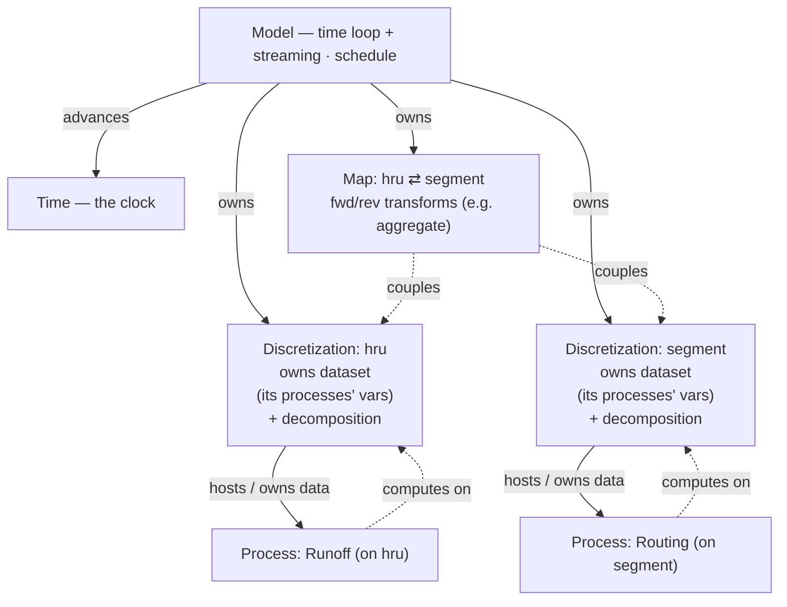

<!-- START doctoc generated TOC please keep comment here to allow auto update -->
<!-- DON'T EDIT THIS SECTION, INSTEAD RE-RUN doctoc TO UPDATE -->

- [Some general ground rules](#some-general-ground-rules)
- [Project context](#project-context)
- [python assumptions/conventions](#python-assumptionsconventions)
- [Prime directive: memory](#prime-directive-memory)
- [incarnations/mpixarray design notes](#incarnationsmpixarray-design-notes)
  - [Core decision: discretization = the unit of decomposition](#core-decision-discretization--the-unit-of-decomposition)
  - [Variable taxonomy: parameters vs inputs (by relationship to model time)](#variable-taxonomy-parameters-vs-inputs-by-relationship-to-model-time)
  - [Serial path (`Model` in `model.py`)](#serial-path-model-in-modelpy)
  - [MPI path (`ModelMPI` in `model.py`) — single-decomposition streaming](#mpi-path-modelmpi-in-modelpy--single-decomposition-streaming)
  - [Known mpixarray limits (Phase 1)](#known-mpixarray-limits-phase-1)
  - [IO is intentionally NOT apples-to-apples](#io-is-intentionally-not-apples-to-apples)
  - [Global state: `Time` + `Options` (the "Global" split)](#global-state-time--options-the-global-split)
  - [Phase 2 backlog (separable, layered on top)](#phase-2-backlog-separable-layered-on-top)
  - [Porting pywatershed processes (goal 4; started July 2026)](#porting-pywatershed-processes-goal-4-started-july-2026)
  - [FlowGraph port: agreed design (July 2026; Stage 1 BUILT + green)](#flowgraph-port-agreed-design-july-2026-stage-1-built--green)
  - [Container-model unification (implemented)](#container-model-unification-implemented)
  - [Object model & serial vs MPI](#object-model--serial-vs-mpi)
  - [Forward design (June 2026 discussion): structure, schedule, open topics](#forward-design-june-2026-discussion-structure-schedule-open-topics)
  - [Build plan: multi-grid, incremental (June 2026)](#build-plan-multi-grid-incremental-june-2026)
  - [Input structuring: serial vs MPI, multi-file / datatree (June 2026)](#input-structuring-serial-vs-mpi-multi-file--datatree-june-2026)
  - [Prior art: xarray-simlab & Landlab (from the retired xr design summary, Apr 2026)](#prior-art-xarray-simlab--landlab-from-the-retired-xr-design-summary-apr-2026)

<!-- END doctoc generated TOC please keep comment here to allow auto update -->

Hi Claude,

# Some general ground rules

0. Never look at files in directories above the directory containin this file
   (this is the "project" directory).
1. Never run git. Never run any git commands that edit history or remove
   uncommitted files. If you want to run "git diff", please ask first.
2. Do not run any code without my explicit permission. I generally like to run
   codes and copy and paste the result to you. There can be exceptions but you
   must ask permission.
3. Before you make very many edits, I like to have a plan that you and I have
   worked out. I like to discuss the plan with you and to be certain of the
   plan before having you make many edits. Please check in with me if anything
   is not clear, you cant find something, or your're unsure what I'm talking
   about. It is always best for you to check in with me!
4. Number 3 above applies at any point in our work. If there is an issue and
   I suggest something, I want you to discuss with me and not rush off trying
   to fix it (unless it's less than about 10 lines of code).
5. I want you to default to SHORT summaries. I'd like a
   concise summary from you directly and it would be nice to ask if i'd like
   additional detail with the summary. Please do not cretae summary files
   without explicit permission.
6. I want you to ask for permission before spawning additional and/or parallel
   agents. I want to be sure the overhead is justified before hand.

I'm looking forward to working with you, this will be fun. Please give a quick
acknowledgement of these ground rules before we start. Thank you!

# Project context

`pws_phoenix` is a rewrite of pywatershed, a physically-based hydrological model.

The goals of the rewrite are to:

1. integrate closely with the xarray dataset model
2. improve performance as much as possible. to that end
   a. integrate with the mpixarray package
   b. leverage numba to the fullest extent possible
   c. optimize IO, particularly output
   d. explore vectorization
   e. focus on accelerating the embarassingly parallel nature of (non-cascading)
   HRUS to start.
3. Use numpy refs underlying xarray to the fullest extent to keep the memory
   footprint low
4. Provide a reasonable pathway to port existing pywatershed concrete Process
   implementations into pws_phoenix.

More design design considerations are writen down in the top-level README.md,
please read that.

Explicitly solved hydrologic models like `pws_phoenix` advances one timestep at a time (Markov dependency via `var_previous`). The spatial dimension is typically an unstructured vector (HRUs), occasionally 2D (x,y). Time × space is therefore the natural chunking shape for scaling studies.

If additional context arises about this project which is useful to add, please let me know

# python assumptions/conventions

1. please use pyton 3.14 syntax, particularly for typehinting.
2. Please read the ruff.toml for line length setting.
3. Avoid single-letter variable names. For throwaway loop variables, prefer doubled letters, e.g. `cc` instead of `c`, `kk` instead of `k`.

# Prime directive: memory

Keep the memory footprint lean and OBVIOUS. Concretely:

1. Reference, don't copy: an array handed to the framework (process_dict,
   Input, Map, Output) IS the working buffer. Never deepcopy anything
   that can hold data -- copy structure only (e.g. a two-level dict copy).
2. Every allocation must be one of: (a) model state, allocated once at
   assembly; (b) a declared, reused per-step window buffer
   (Input.current_values, Map.target_values, Output chunk buffers);
   (c) a temporary inside a numba kernel. Anything else is a bug, or
   carries a comment justifying it.
3. Watch for hidden copies and call them out in review: deepcopy,
   np.asarray/astype on existing arrays, fancy indexing, xarray ops that
   materialize (selection on lazy datasets -- see test_ref_behaviors.py).

# incarnations/mpixarray design notes

`incarnations/mpixarray/` blends the serial xr Process framework (developed in
`incarnations/xr/`, since retired -- see git history; its design summary is
distilled in "Prior art" below) with mpixarray's streaming MPI IO. The code is
split into `globals.py` (`Time`), `data_io.py` (serial IO primitives),
`discretization.py` (`Discretization`), `map.py` (`Map` + `MapMPI`),
`process.py` (`DataArrayMeta` + the `Process` ABC), `model.py` (`Model`
serial + `ModelMPI` streaming), `config.py` (minimal yaml ->
`(process_dict, control, maps)`; a probe for the `Options` design),
`processes_concrete.py` (the toy Upper/Lower processes), and
`hydrology/` (REAL pywatershed process ports, mirroring pywatershed's
`hydrology/` module structure -- one process per module; see "Porting
pywatershed processes" below).
`model.py` is the top of the import stack (it imports `data_io`,
`discretization`, `globals`, `process`); `config.py` sits beside it (atop
`map` + `process`); `map.py` is foundational (numpy/xarray only; `Map`
objects are passed into the Model); `process.py` imports only
`globals.py`. `Process.new()` and the `PWS` accessor were
retired (July 2026 -- see git history) when the Model took over per-grid
dataset assembly. Phase 1 is implemented and tested (serial via pytest; MPI
via pytest-mpi).

## Core decision: discretization = the unit of decomposition

The unit of MPI decomposition (and of barriers / the shared dataset) is the
**discretization** (the grid). "One shared decomposed dataset" really means
"one dataset per discretization." The single-grid toy has exactly one
(`space`); the serial two-grid toy (Step A, `tests/test_two_grid.py`) has
two; mixed MPI/serial grids are Step B.

## Variable taxonomy: parameters vs inputs (by relationship to model time)

A field's `kind` (`DataArrayMeta.kind`) and its time axis decide how the
framework treats it. The discriminator is the variable's time coordinate vs
**model time** (daily, fixed, known at init):

- **Static parameter** (`kind="parameter"`, no time axis) -- a fixed property /
  calibration. Loaded once, resident, read-only. (`param_up_0`,
  `param_shared_name`)
- **Time-varying parameter** (`kind="parameter"`, a time axis whose coordinates
  are **not** model time) -- varies in time but is indexed by a _derived_
  coordinate. Common forms:
  - _cyclic_ -- repeats on a calendar cycle (`month` 1-12, `season`); indexed by
    `f(model_time)`, e.g. `param_up_1[time.month - 1]`.
  - _coarse linear_ -- monotonic but coarser than model time (per-year,
    per-(year,month)); indexed by flooring model time.
    Resident (its own small axis kept whole; space-decomposed in MPI), read-only;
    the current slice is looked up each step. The toy's `param_up_1` is
    cyclic-monthly `(month, space)`, indexed in `Upper.calculate` via `time.month`.
- **Input / time-varying input** (`kind="input"` / `"mutable_input"`, time axis
  **==** model time) -- external forcing/boundary data, one model-time slice
  served per step in lockstep. (`forcing_up`, `forcing_low`)

**Rule (enforced in `ModelMPI._build`):** a `parameter` declared on the model
`time` axis is a misdeclaration -- a variable on model time is an _input_, so a
time-varying parameter must use a non-`time` axis. This also corrects the old
"time-varying params are neither static nor streaming" framing: a cyclic param
is **resident + indexed**, distinct from a _streamed_ input.

To the _Process_, the current slice looks like an input -- a `(space,)` array.
The process holds `time` and does the lookup; `_calculate` receives raw numpy
(the `(space,)` slice), never the `Time` object (numba boundary).

## Serial path (`Model` in `model.py`)

- The Model assembles ONE shared `xr.Dataset` per grid from its processes'
  field declarations (`Model._add_process_fields`) and binds each process to
  it directly (`cls(grid_ds)`). Same-named vars are added once, so
  cross-process buffer sharing (`param_shared_name`,
  `Upper.flow → Lower.flow`) is _structural_ -- the same named variable --
  exactly as in MPI. The old `Process.new()` per-process datasets and the
  `PWS` accessor are retired (July 2026; see git history); the
  `a.values is b.values` checks survive only as near-tautological test
  asserts.
- The Model copies `process_dict` STRUCTURE only (a two-level dict copy; NO
  deepcopy): the caller's in-memory arrays ARE the model's working buffers
  (zero-copy, per the memory prime directive), and the model's read-only
  flags (parameters, read-only inputs) therefore apply to them
  (`test_zero_copy_inputs`).
- The selective in-place `parameters[pp].load()` before wiring a parameter
  into the grid dataset is still load-bearing for file-backed parameters
  (see `tests/test_ref_behaviors.py`).
- `Process._registry` (`__init_subclass__`) is used by
  `config.load_model_yaml` to resolve process classes named as strings in a
  yaml configuration (import the defining module first). The other
  anticipated consumer is restart/checkpoint rehydration.
- Output: `data_io.Output` — a buffered, time-chunked **zarr** writer (adapted
  from pywatershed `base/output.py`): one store at
  `control["output_serial_zarr"]` (a `.zarr` path, used verbatim -- what
  you write in the control dict is what appears on disk), all output vars
  as data_vars, full-chunk
  **appends** along `time` (the
  first append creates the store; it is never pre-sized/materialized -- peak
  memory = the chunk buffers) + a partial tail at `finalize`. Appends
  suffice BECAUSE this writer is serial; concurrent writers would need a
  pre-sized store + region writes. (netCDF4 was dropped.)

## MPI path (`ModelMPI` in `model.py`) — single-decomposition streaming

Uses the real mpixarray streaming API:
`open_dataset → parallelize(dims=["space"]) → set_streaming("time") →
open_writer → declare buffers → create → iter_time → write`.

- ONE decomposed dataset (`ds_mpi`) carries every process's state, parameters,
  per-step input buffers, and streaming outputs. Because there is one dataset,
  cross-process buffer sharing is **structural** (the same named variable) --
  not emulated by hand and asserted.
- Processes bind directly (`cls(ds_mpi)`) and are rebound to each `step` in the
  loop. (`Process.new()` is retired entirely; the serial path also binds
  directly to its grid's shared dataset.)
- Inputs: time-dimensioned file vars are dropped by `set_streaming` and refilled
  each step from `step.mpi.src`; static space-only params/ICs survive on
  `ds_mpi` (loaded into memory so their buffers are shared by reference).
- `parallelize()` now lives in **`Discretization`** (`discretization.py`):
  `disc.decompose(ds)` does the space split (MPI) or identity (serial,
  `comm=None`). `set_streaming` (time) stays in `ModelMPI`. The datasets:
  `ds_mpi` (decomposed) -> `ds_mpi_stream` (streaming). Model/ModelMPI hold
  `self.discretizations` (a `dict[str, Discretization]` keyed by grid name)
  -- a 2nd grid is just another key. Step B (done): an MPI run hosts ONE
  distributed grid (`control["mpi_grid"]`) plus any number of serial grids
  replicated on every rank (their `Discretization` is the serial degenerate
  one; their data never enter the mpixarray dataset).

## Known mpixarray limits (Phase 1)

- Only ONE `to_netcdf=True` streaming-output var works; a 2nd trips a
  "cannot pickle 'module' object" deepcopy (the writer handle is stamped onto
  shared coord attrs, and the next `from_numpy` deepcopies them). So we stream
  `flow` to disk and validate `storage_previous` from final in-memory state.
- `set_streaming` requires the streaming dim to be a real dim-coordinate.
- A non-`time` extra dim on a resident var (e.g. a `(month, space)` cyclic
  time-varying parameter) is assumed to survive `set_streaming` untouched (it is
  not the streaming dim) and stay space-decomposed -- the toy exercises this.

## IO is intentionally NOT apples-to-apples

Serial → zarr; MPI → mpixarray's NetCDF stream. The best IO backend differs by
context, so the two ends are deliberately divergent -- do **not** homogenize
them via a shared writer. (Only matters when isolating compute-vs-IO time in a
scaling study.) Under MPI, serial (replicated) grids also write **zarr** via
a rank-0 `Output` -- the backend follows the grid's context, consistent with
this decision.

## Global state: `Time` + `Options` (the "Global" split)

The "Global" item is split into two objects with different lifetimes and reach
(rather than one bundled pywatershed-style `Control`):

- **`Time`** (`globals.py`, implemented) -- the model clock: runtime state,
  passed **all the way down** to a process's `calculate(dt, time)` and
  transparent for debugging. Daily, fixed, known at init. Exposes `.current` (a
  `datetime64`), `.month`, `.year`; `set_index(i)` points it at a timestep.
  - _Serial:_ the Model drives the loop and calls `time.set_index(tt)`.
  - _MPI:_ mpixarray owns the time _loop_, so `Time` is **synced from** each
    streaming `step` (`enumerate(iter_time())`). A Process reads it identically
    either way -- this keeps the serial/MPI fork from deepening.
- **`Options`** (not yet a class) -- construction-time run config, consumed at
  _build_ and baked into processes; a Process never needs it at runtime. The
  Model `control` dict plays this role today. (`config.load_model_yaml` --
  a minimal yaml -> `(process_dict, control, maps)` loader, July 2026 -- is
  a first serialization probe for this design; classes resolve by name via
  `Process._registry`, paths resolve relative to the yaml.)

Mechanism notes:

- `Time` is **passed as an argument** to `calculate`, not stashed on the dataset
  (the serial `pws` accessor is built lazily, so passing is cleaner and uniform
  with MPI). `advance()` stays **time-free** -- pure `*_previous` bookkeeping.
- numba boundary: the `Time` object reaches `calculate()`; into a
  `@staticmethod _calculate` pass raw scalars (e.g. a month index), since numba
  can't take the object.
- `time.month` is what a time-varying parameter indexes on (`Upper.calculate`).

**Calendar helpers (ported from pywatershed `utils/time_utils.py`).**
`Time` exposes `year`, `month`, `day_of_month`, `doy` (day-of-year), and `dowy`
(day-of-water-year, Oct 1) -- all matching pywatershed's formulas. All fields
are **1-based** (calendar-natural, = pywatershed's `zero_based=False` default);
positional time-varying-parameter lookup therefore indexes with `field - 1`
(convention (A); see `Upper.calculate` and `tests/test_time.py`). Still in
pywatershed if needed: `jsol` (days since solstice, niche) and `epiweek` (needs
the `epiweeks` dep).

## Phase 2 backlog (separable, layered on top)

- `Options` class -- the construction-time half of the old "Global" item
  (`Time` is implemented; see "Global state: `Time` + `Options`" above). The
  Model `control` dict serves as `Options` for now.
- The full `Discretization` class: physical/topology role + multiple
  discretizations (incl. whether `set_streaming` aligns across ≥2 of them).
- `ModelInputs` / `input_spec()` / `resolve_inputs()` / `init_run_phase()` lazy
  lifecycle (`get_inputs()` is already classmethod-level; streaming's `create()`
  is a latent `init_run_phase`).
- Multi-output-var streaming once the mpixarray deepcopy bug is fixed.
  (Cyclic-monthly time-varying parameters are implemented -- see "Variable
  taxonomy".) Coarse-linear (e.g. per-(year,month)) time-varying params remain.
- Deferred review minors (July 2026): generalize `Output` beyond 1-D
  spatial vars (only when a real multi-dim output var exists -- it fails
  loudly today); rename `map.py`/`globals.py` (they shadow builtins) when
  this becomes a package.
- **Budget / ConservativeProcess** (flagged during the PRMSGroundwater
  port, July 2026): not ported yet; when it comes, SCRUTINIZE its design
  first (e.g. the separation/combination of mass and energy budgets).
- **Dis-owned parameters (IMPLEMENTED July 2026)**: pywatershed's
  `utils/separate_nhm_params.py` splits parameters into per-process
  files and DIS files (`dis_hru_vars`: hru_area, hru_in_to_cf, ...;
  `dis_seg_vars`: seg_length, tosegment, ...). Now:
  `Discretization(dims, parameters=<dis dataset or Path>)`;
  `Model`/`ModelMPI` take an optional `discretizations=` dict (MPI:
  serial grids only -- the distributed grid's dis vars ride in
  input_file); assembly sources declared parameters **dis-first**, then
  the process `parameters` dataset. A process still DECLARES the dis
  vars it reads (`kind="parameter"` -- the declaration states the
  need). `Discretization.topological_order(to_index)` = generic derived
  topology (networkx, replicating pywatershed's construction EXACTLY --
  a different valid order changes float accumulation downstream; a
  dependency-free ordering is a later step with a tolerance decision).
  A future `Model.from_yaml()` classmethod (evolution of
  `config.load_model_yaml`) will construct Discretizations from a yaml
  section.
- **Per-process init hook (IMPLEMENTED July 2026)**:
  `Process.initialize()` (default no-op), called once by the Model
  after binding/ICs/input-validation, before the run loop; contract =
  LOCAL (no collectives), no `Time`. Computes
  **`kind="parameter_derived"`** fields (parameters COMPUTED at init
  rather than supplied -- e.g. Muskingum c0/c1/c2 from mann_n + dis
  vars; kept in-model over offline precompute for single-source-of-
  truth with the calibration params). Allocated like variables
  (placeholder-dim resolution; int64 fill = iinfo.min), frozen
  read-only after ALL hooks run. `tests/test_discretization.py`.
  DELIBERATE later step: pywatershed channel-init *edits* `seg_slope`
  in place (its own "bad idea" comment) -- must be addressed
  explicitly, not silently replicated (dis vars are read-only here;
  note velocity is computed BEFORE the clamp upstream, so the edit is
  inconsequential within channel init itself).

## Porting pywatershed processes (goal 4; started July 2026)

The staged plan (agreed with JLM): (1, DONE) `hydrology/
prms_groundwater.py` -- PRMSGroundwater on a distributed hru grid,
validated against pywatershed's drb_2yr answers
(`tests/test_prms_groundwater{,_mpi}.py`); (2, DONE)
`hydrology/prms_channel.py` -- PRMSChannel on the serial segment grid
+ the hru->segment aggregation as three explicit Maps (pywatershed
does it internally via `hru_segment` in `_calculate`) -> a REAL
two-grid submodel (groundwater live -> channel;
`sroff_vol`/`ssres_flow_vol` from disk via a carrier process --
`tests/test_prms_channel{,_mpi}.py`, serial + distributed w/ MapMPI
x3); (3, next) optionally PRMSRunoff replacing the disk-fed
`sroff_vol`.

Stage-2 findings: the map-then-sum float-order deviation proved BENIGN
(all flow vars match at 1e-13); the one tolerance carve-out is
`seg_stor_change` = (seg_inflow - seg_outflow)*s_per_time -- a
difference of near-equal numbers, cancellation amplifies the residue
(1e-7/1e-4; both operands validated at 1e-13). dt is SECONDS
(86400.0) for real models -- s_per_time = dt in the channel;
groundwater never reads dt.

Port conventions (established by the groundwater port):

- Names verbatim (params/inputs/variables) -- the pathway back to
  pywatershed domains and answer files.
- What is NOT ported: Budget/ConservativeProcess (backlogged, above),
  adapters, restart, `calc_method` switch (numba is THE path),
  `verbose`, unused declared params (e.g. `gwstor_min`).
- Kernels: rewrite pywatershed's allocate-and-return-tuple
  `_calculate_numpy` to the in-place out-first convention as an
  EXPLICIT element loop with scalar temporaries -- numba's expression
  fusion does NOT eliminate NAMED intermediate arrays, so pywatershed's
  staged array style would allocate every step. Keep the per-element
  operation order identical to pywatershed's.
- Validation: pywatershed's own autotest tolerance (rtol=atol=1e-13)
  against its generated answer files (`test_data/<domain>/output/`,
  produced by the autotest data-generation workflow -- not checked in).
  Tests skip cleanly when the data are absent. The pywatershed repo
  lives at the mpix meta-repo root.
- **Dim-name gotcha:** pywatershed's generated output files put
  variables on the `nhm_id` dim; its parameter files use `nhru`.
  Rename to the grid dim when assembling model inputs (`.rename()`).
  The framework now REJECTS mismatched input dims at build (serial
  assembly + `ModelMPI._build`) -- without the check, serial silently
  "worked" by size coincidence and MPI broadcast-errored
  mid-collective (July 2026).
- mpixarray handles UNEVEN decomposition (drb_2yr's 765 HRUs over 4
  ranks -> 192/191/191/191) -- the toy tests' even sizes were never
  load-bearing.
- **Upstream issue to report (ncxarray, July 2026):**
  `ncxarray/nc_DataArray.py:331` stamps a default `nan` fill value on
  EVERY written variable, including a `datetime64` `time` coordinate ->
  "invalid value encountered in cast" RuntimeWarning at write + xarray
  SerializationWarning ("non-conforming '_FillValue' ... dropping") at
  read-back. Benign for results; surfaced by the first real
  datetime64-time output (gw MPI test; the toy never triggered it).
  Fix belongs in ncxarray: skip/type the fill value for coordinate and
  non-float variables.
- Stage-2 framework part (a) is DONE (dis-owned params + init hook +
  `parameter_derived`; see the Phase-2 backlog entries above).
  Decisions taken with JLM: `segment_order` is DIS-owned (topology);
  Kcoef/c0/c1/c2/ts/tsi are PROCESS-owned (`parameter_derived`,
  computed in `initialize()` from mann_n/x_coef + dis vars); the three
  lateral-inflow fluxes are mapped to segments SEPARATELY (three Maps,
  same weights by reference) and summed in the channel kernel
  (`seg_lateral_inflow` IS channel physics; a 2nd segment process can
  consume any subset; a multi-variable single-weights Map = flagged
  efficiency extension, one batched matmul+Allreduce). Mapped-flux
  names on the segment grid (e.g. `seg_sroff_vol`) are NEW names --
  the first deliberate departure from names-verbatim.

## FlowGraph port: agreed design (July 2026; Stage 1 BUILT + green)

**Status:** Stage 1 + Stage 2 Rounds A-D implemented and validated
(July 2026) -- ALL pywatershed flow-node types are ported.
`flow_graph.py` (make_flow_graph factory + njit kernel); node types
`hydrology/prms_channel_flow_node.py`, `pass_through_flow_node.py`,
`starfit_flow_node.py`, `obsin_flow_node.py`,
`source_sink_flow_node.py`, `starfit_source_sink_flow_node.py`.
`tests/test_flow_graph.py` -- pure-channel plus three insertion
scenarios (pass-through / neutral source_sink splice / neutral obsin
headwater, all above nhm_seg 1829) match the drb seg_outflow answers
at 1e-10 (pywatershed's own scalar-node standard);
`tests/test_starfit_flow_node.py` matches the STARFIT reference means
at 1e-7 (Round B below); `tests/test_obsin_source_sink_nodes.py` =
synthetic hand-computed branch coverage (Round C below).

**Stage 2 Round A DONE (registry dispatch):** the Stage-1 hand-coded
2-branch switch is GONE. Each node type now supplies the njit contract
`prepare(inode, state)` / `substep(istep, inode, state)` /
`finalize(inode, n_sub, state)` (uniform sigs; `state` = the
composition's graph-state NAMEDTUPLE of all union arrays, built once in
initialize() -- refs, no per-step alloc) alongside numpy
`initialize_type`/`advance_type` + `fields`. The kernel
(`_build_graph_kernel`) dispatches each via `literal_unroll` over the
per-type function tuples; graph-level work (lateral sum, routing,
outlet) stays in the kernel. `_KERNEL_TYPE_NAMES` gate + `_UNUSED`
stand-ins DELETED; a node-type-contract check replaces them. Adding a
type = write the 5 methods + declare fields, NO kernel edit. Tests
byte-identical green at 1e-10. Rides `NumbaExperimentalFeatureWarning`
(literal_unroll, ~21/run). STARFIT = FlowGraph Stage 2 Round B (first
real new type through the registry). The spike finding below is the
record of WHY this shape.

**Stage 2 Round B DONE (STARFIT, July 2026):**
`hydrology/starfit_flow_node.py` -- StarfitFlowNode, the first real
new type through the registry: NO kernel edit was needed, the contract
held. Scope (agreed): the HOURLY path only, cms-NATIVE units.
Framework half (B-1): graph-level `n_substeps` on `make_flow_graph`
(ALL nodes share it; substep length = 24/n_substeps hours; 24 =
channel muskingum, 1 = STARFIT-only -- channel/pass-through take and
ignore the new `initialize_type(dataset, n_substeps)` param); per-step
`tctx` time-context namedtuple threaded to every `substep` (union of
the types' optional `time_context` decls; only NEEDED fields computed);
`Time.current_epiweek` (CDC epiweek 1-53, lazy `epiweeks` import;
conda-forge package = `epiweeks4cf`, added to environment.yaml).
Node half (B-2): numerics verbatim from pywatershed
`_calc_istarf_release` + hourly pre/post-release, scalars at [inode] --
incl. the ORDER-SENSITIVE `7.0*flow*24.0*60.0*60.0` weekly volumes
(pywatershed's own warning); `m3ps_to_MCM` =
(24/n_substeps)*3600/1e6 is a `parameter_derived` per-node broadcast
so the njit substep reads it from `state`; epiweek 53 folds to 52 in
`substep`. Parameters FREEZE at assembly => pywatershed's in-node
data-prep moved OUT of the node: nan `Obs_MEANFLOW_CUMECS` <-
`inflow_mean` is caller data-prep, nan `initial_storage`
(NOR-midpoint + start/end active-window gating) is NOT ported --
`initialize_type` RAISES on both, scoped to its OWN rows via
`node_type_names` attrs now stamped BEFORE the type hooks (small
`flow_graph.initialize` reorder). Also NOT ported: `io_in_cfs` (THE
next STARFIT step -- required to compose STARFIT into a cfs channel
graph), `compute_daily` (pywatershed flags it for deletion), Budget.
Validation `tests/test_starfit_flow_node.py` = the pywatershed
autotest recipe (cms case): 115 reservoirs as isolated outlet nodes
(`to_graph_index=-1`), n_substeps=1, `lake_inflow.nc` fed as a volume
input (x 86400; kernel divides by s_per_time), TIME-MEANS of
lake_storage/lake_release/lake_spill vs
`starfit_mean_output_1995-2001.nc` at 1e-7 (pywatershed's own
tolerance) -- green on the first run; full serial + 4-rank MPI sweep
green.

**Stage 2 Round C DONE (obsin + source_sink, July 2026):**
`hydrology/obsin_flow_node.py` (outflow = observed/specified flow;
negative obs = pass through; NOT mass conservative) +
`hydrology/source_sink_flow_node.py` (outflow = inflow + requested
source/sink; sinks limited/skipped by `flow_min`) -- two more types
through the registry, no kernel edits. Port decisions: pywatershed's
per-node pandas-Series-by-date lookups become `kind="input"` fields
(`node_obs_flow`, `node_source_sink`) served in lockstep
(`missing_data_as_zero` NOT ported = data-prep); each type's
`_seg_outflow` scalar lives directly in the graph's
`node_outflow_substep` work buffer (own row only) -- sole state is a
sink/source accumulator; the per-substep running mean collapses to
one divide in `finalize` (identical value). Both harvest
`node_sink_source` (obsin: created/discarded flow; source_sink: the
APPLIED source/sink) = the motivating consumers for the deferred
Budget design. **Behavioral finding (verbatim pywatershed):** an
obsin node with obs < 0 LATCHES the first substep's inflow as its
outflow for the whole day -- NOT pass-through-equivalent under
sub-hourly-varying upstream muskingum flow (caught by a failing
first version of the drb equivalence test). Tests:
`tests/test_obsin_source_sink_nodes.py` (synthetic, hand-computed,
every branch, no external data -- the first FlowGraph tests that run
in CI) + two new drb scenarios in `tests/test_flow_graph.py`
(neutral source_sink splice reproduces the pass-through answers;
neutral obsin as a zero-inflow HEADWATER above nhm_seg 1829 -- see
the latching finding).

**Stage 2 Round D DONE (starfit_source_sink, July 2026) -- ALL
pywatershed flow-node types now ported:**
`hydrology/starfit_source_sink_flow_node.py` -- STARFIT whose
sources/sinks divert STORAGE (before the release calc), min-storage
rule for sinks. pywatershed subclasses StarfitFlowNode; here the same
seams are SHARED njit helpers refactored out of starfit_flow_node.py
(pre_release_calculations / istarf_release(storage as ARG) /
post_release_calculations(applied-diversion as ARG; 0.0 for the plain
node = IEEE identity, byte-equivalent -- Round B test stayed green
through the refactor) + starfit_prepare/starfit_finalize/
initialize_starfit_type(type_name)/starfit_advance_type). The
combined substep = pre -> diversion calc -> release(from
lake_storage_after_source_sink) -> post(+applied diversion in the
storage change); finalize overwrites node_sink_source with the
applied-diversion running mean. `node_source_sink` input META is
SHARED with SourceSinkFlowNode (same object -- one array serves both
in a mixed graph). Names adopt pywatershed's own "very confusing"
TODO: `lake_sink_source_sub`/`lake_sink_source`/
`lake_sink_source_accum` (= its _source_sink/_sink_source/
_sink_source_sum). NOT ported: `_negative_sink_source`
(Budget-only). Validation mirrors pywatershed's OWN combined-node
autotest (cms): tiny constant sink (-28e-17), storage_min=0, same
115-reservoir reference means at 1e-7 -- parametrized into
tests/test_starfit_flow_node.py; plus an applied-diversion check
(one reservoir drains to empty and exercises the min-storage
limiting branch for free). Family caveat: a both-starfit-types graph
runs the shared advance twice -- safe (idempotent march; see
starfit_advance_type docstring).

**io_in_cfs DONE (July 2026) -- STARFIT composes into cfs graphs:**
`make_flow_graph(..., io_in_cfs=True)` (GRAPH-level flow units;
default True = the pywatershed/NHM convention), threaded to the
hooks: `initialize_type(dataset, n_substeps, io_in_cfs)` (contract
grew again; the 4 unit-agnostic types ignore it -- muskingum/
pass-through/obsin/source_sink are linear in flow). DESIGN: no
branches in njit code -- the STARFIT family gets two
parameter_derived per-node broadcasts `io_to_cms` / `cms_to_io` set
to the pywatershed constants (cms_to_cfs = 35.314666721489, module
constants in starfit_flow_node.py; its cm_to_cf == cms_to_cfs so one
pair serves flows AND storages) in a cfs graph and to **1.0 in a cms
graph -- multiplying by 1.0 is an IEEE identity, so the validated
cms path is byte-identical**. Conversion points (pywatershed
hourly-path verbatim): inflows in at pre_release; the routed
lake_outflow_sub out at the end of post_release; the 7 harvested
outputs (incl. storages -> millions of cubic feet) in
starfit_finalize BEFORE harvest -- incl. the verbatim
lake_storage_old double-conversion (harmless: rewritten in advance;
corrupts only the transient advance-computed change) -- ; combined
node: request converted AT READ (input buffer is read-only;
pywatershed converts in prepare) and lake_sink_source leaves in io
units per substep. QUIRK kept: `source_sink_storage_min` is ALWAYS
internal MCM even in cfs (pywatershed never converts it).
Validation: test_starfit_flow_node.py parametrized node class x
{cms, cfs} = the full pywatershed autotest matrix, all at 1e-7
(cfs = inflows/initial_storage/answers x the constants, as the
autotest does). Next natural step: a real mixed channel+STARFIT drb
graph (n_substeps conflict: channel wants 24, STARFIT reference is
1 substep/day -- needs a decision).

**STARFIT daily mode DONE (July 2026; parity green first run):**
`hydrology/starfit_daily_flow_node.py` = pywatershed
compute_daily=True, verbatim -- daily physics inside a sub-daily
graph: constant outflow through each day's substeps, computed at the
PREVIOUS day's end from that day's mean inflow (ONE-DAY LAG, a
forecast structure; first day seeded from the first substep's
inflow); spill computed WITHOUT capping storage (verbatim).
**The "fake daily" trick, now documented in 3 places** (daily module
= the full story; hourly module + test point there): the daily
reference is CONCURRENT (release from the same day's inflow +
current storage); the hourly node with n_substeps=1 (one 24-h
substep) reproduces exactly that, hence the 1e-7 reference matches.
Daily mode can NEVER match that reference tightly (the lag) -- do
not "fix" it to. JLM's old can't-match-answers memory = this
structural lag, most likely. **pywatershed has NO value-level
validation of daily mode** (node autotest = hourly only; mixed-graph
autotest pastes actuals as answers for new nodes) -- so validation
here = A/B PARITY vs pywatershed's own compute_daily node driven
identically (tests/test_starfit_daily_parity.py; 15 reservoirs x 365
d x 24 substeps, cms, 1e-10) -- validates the PORT, not the physics.
Parity needs pywatershed IMPORTABLE: mpix-root clone via sys.path +
deps pyPRMS (pip) / tqdm / contextily (conda) in environment.yaml;
skips cleanly otherwise. Framework: substep contract grew to
`substep(istep, inode, state, tctx, n_sub)` (symmetric w/ finalize;
daily needs the last-substep test); `tctx` gained `itime_step`
(free, always served); `initialize_starfit_type` now writes OWN-ROWS
so family types hold DIFFERENT m3ps_to_MCM in one graph (daily =
full-day basis regardless of graph n_substeps) + `compute_daily=`
kwarg; `istarf_release` takes lake_inflow as an ARG (hourly:
_sub; daily: day mean). Daily requires n_substeps >= 2
(initialize_type raises; 1-substep first day never reaches the
last-substep bookkeeping -- latent pywatershed edge, it hardcodes
24). pywatershed's unused-for-daily `*_sub_next` allocations (except
lake_outflow_sub_next) NOT ported; no daily source/sink variant
(pywatershed hardcodes compute_daily=False there).

**Mixed channel+STARFIT graph GREEN (July 2026; both reservoir modes
passed FIRST RUN once ucb_2yr data were generated):**
`tests/test_mixed_channel_starfit.py` mirrors pywatershed
test_starfit_flow_graph.py -- **domain = ucb_2yr, NOT drb** (Big
Sandy, grand_id 419 in starfit/istarf_conus_grand.nc, at its real
location; the pywatershed test skips all other domains). First
3-type composition (channel + pass_through + starfit|starfit_daily,
parametrized over reservoir mode), n_substeps=24, io_in_cfs=True.
Geometry = the pywatershed helpers' INTERCEPTION semantics (the
target's upstreams are redirected into the chain): [44426's ups] ->
PT2 -> STARFIT -> PT3 -> seg 44426, and [44409's ups] -> PT1 ->
44409 (its disconnected-node wrinkle not replicated). Big Sandy's
nan initial_storage + NaT start_time -> the NOR-midpoint seed is
replicated TEST-SIDE (epiweek of time0 - 1 day = the pywatershed
control-init time; raw week; supplied in Mcf). Checks (pywatershed's
own rigor -- it has no reference for the reservoir): segments not
downstream of 44426 match seg_outflow at 1e-10 (the transparent
44409 chain is NOT ignored); PT transparency + outflow ==
release+spill at 1e-12. A full pywatershed-FlowGraph A/B is
deferred (~8M pure-python node-substep calls). conftest gained the
session `pyws_domain(domain)` factory + `pyws_domain_files()` skip
helper (test_flow_graph.py now consumes "drb_2yr" through it).

**Numba dispatch spike DONE (July 2026, numba 0.65.1) -- registry
mechanism now DECIDED (supersedes the "closure-binding" hope in the
design notes below):**
- Captured (freevar/global) arrays are `readonly` under `@njit` --
  writing to one is a TypingError ("Cannot modify readonly array").
  So the closure-binding signature (`substep(istep, inode)` closing
  over its own field arrays) is DEAD.
- Numba rule: writable state must be an ARGUMENT. VERIFIED working
  registry pattern: per-type `@njit substep(istep, inode, state)`
  where `state` is a NAMEDTUPLE of the union arrays (array fields of a
  namedtuple ARGUMENT are writable), dispatched by `literal_unroll`
  over the function tuple (compiler-generated switch, kernel closes
  over the tuple, recompiles per composition). Adding a type = add its
  `substep` fn + its arrays to the state namedtuple; NO kernel edit.
- Rides `NumbaExperimentalFeatureWarning` (first-class function
  types) -- experimental but functional in 0.65.1.
- First-class-function-types + `typed.List` (fully dynamic, no
  per-composition recompile) also failed only on the readonly-capture
  issue; would work with the same namedtuple-argument state if that
  path is ever preferred over literal_unroll.

Stage 3 direction (JLM's call): port pywatershed FlowGraph
(`base/flow_graph.py`) -- heterogeneous flow-node types composed on one
DAG (e.g. insert a reservoir into a muskingum network). SERIAL-only
target, which costs nothing: the graph grid sits exactly where the
segment grid sits (serial in serial, REPLICATED + MapMPI-fed under MPI
-- the Step B pattern; no FlowGraph MPI code ever).

Core redesign (a design project, NOT a names-verbatim port): pywatershed
uses one Python object per node (scalar properties, polymorphic
dispatch) -- structurally incompatible with numba and our memory
directive. The phoenix version keeps the CONCEPT, re-expressed as data:

- **FlowGraph = a Process on its own `nnodes` discretization.** The dis
  owns `to_graph_index` (+ `node_order` via `topo_order=`;
  `topological_order` gains `one_based=` -- PRMS-legacy connectivity
  [tosegment, legacy files] is 1-based/0=outlet, native FlowGraph
  [to_graph_index] is 0-based/-1=outlet; default stays legacy).
- **Node types dissolve into data**: union-of-fields (all types'
  params/state as (nnodes,) declarations, nan where not applicable --
  the flat-pool decision at node granularity; pywatershed's ragged
  `_addtl_output_vars` dissolves into ordinary variables); `node_type`
  int codes INTERNAL ONLY -- builders speak names via the composed
  class (`kind_code(name)` + `{code: name}` map, mapping also stamped
  into `node_type.attrs` for self-describing datasets). Makers
  dissolve: data-prep -> initialize() (SHARING the muskingum
  coefficient derivation refactored out of PRMSChannel.initialize into
  a module function); instantiation -> nothing (no per-node objects).
- **`make_flow_graph(kinds=(...))` class FACTORY** -- the class's
  declarations are the union of its node types' fields, so the class
  is composed per model; kind codes = position in `kinds`.
  Model.__init__ itself is UNCHANGED (a FlowGraph is just another
  process_dict entry; see the mockup in session notes / git history).
- **Compute = switch-kernel (IMPLEMENTED via registry dispatch, Round
  A)**: per-type scalar `@njit` substep functions (pywatershed's own
  `_calculate_subtimestep` numerics) called from ONE njit graph kernel
  walking `node_order` x 24 substeps; order-exact, zero per-step
  allocation. The registry dispatch uses `numba.literal_unroll` over
  the per-type function tuples (compiler-generated switch, recompile
  per composition). The uniform per-type signature was the design crux
  -- RESOLVED by the spike (see the status box above): per-type `@njit
  substep(istep, inode, state)` with `state` a NAMEDTUPLE of the union
  arrays (closure-binding is dead -- captured arrays are readonly under
  njit; namedtuple-argument
  array fields are writable).
- **Inflows**: three Map-fed volume inputs on nnodes + in-kernel sum
  (the channel map-then-sum decision carried over); inserted nodes =
  zero ROWS in the weights.
- **Terminology**: keep names `FlowGraph` / `PRMSChannelFlowNode` /
  `PassThroughFlowNode` (continuity with pywatershed); say "node
  TYPE" internally, never "kind" (collides with DataArrayMeta.kind).
- **Module homes**: `flow_graph.py` at incarnations/mpixarray root
  (framework infra, beside map.py); node types in `hydrology/`
  (prms_channel_flow_node.py, pass_through_flow_node.py).
- **Stage-1 scope + validation**: channel + pass-through types only.
  Test 1 = pure-channel graph (456 nodes) vs drb seg_outflow answers;
  test 2 = pywatershed's doctest scenario (insert one pass-through
  above nhm_seg 1829, 457 nodes) vs same answers on non-inserted
  nodes. Tolerance **1e-10 = pywatershed's OWN standard** for
  scalar-node-vs-array muskingum. Graph-building arithmetic
  (splice/pad) stays test-side; helper (a la
  prms_channel_flow_graph_to_model_dict) when it stabilizes.
- **NOT ported** (recorded): Budget + `sink_source` (the motivating
  case for the deferred Budget design -- reservoirs source/sink mass),
  plot()/pyvis, initialize_netcdf, InflowExchange factory (revisit
  with composition), type_check_nodes, allow_disconnected_nodes knob
  (our topological_order does the permissive prepend; strict/warn =
  Options item). STARFIT = FlowGraph Stage 2 (the payoff + the
  registry-dispatch forcing function).
- **Feeds back to the composition open topic**: heterogeneous
  sub-units compose as DATA (type codes + union fields + per-type
  kernel functions), not contained objects.

Build order (agreed): round 1 = framework touches (`one_based=`,
coefficient-derivation refactor; suite green before proceeding);
round 2 = flow_graph.py + node types + the two tests + numba spike.

## Container-model unification (implemented)

Serial and MPI share ONE container model: one shared dataset _per
discretization_, with serial as the _degenerate_ case (one rank, full extent,
plain-xr backend instead of mpixarray). A `Process` only touches
`self._obj[name].values` and is agnostic to whether `_obj` is a serial grid
dataset or a view into the decomposed `ds_mpi`. Buffer sharing is _structural
in both_ (a same-named var is added to the grid dataset once), which deleted
the fragile serial wiring and its `a.values is b.values` asserts (they
survive only as near-tautological test checks) -- serial = "MPI with one
rank, no MPI."

Still holds:

- The `finalize` contract is "**releases external resources**," NOT "deletes
  data": serial `finalize()` only closes I/O handles (its in-memory grid
  datasets survive -- _wanted_, for interactive/post-run inspection), while
  MPI `finalize()` closes `ds_mpi`. Do not make serial delete its data.
- **Namespacing:** one shared dataset per grid flattens process namespaces --
  two same-grid processes cannot each have a private `flow`. Per the
  flat-layout decision under "Forward design," collisions are to be detected
  at assembly; NOTE that check is not yet implemented (same-named vars
  silently share today).

## Object model & serial vs MPI

**All five classes and their relationships.** Serial and MPI share **one object
graph** -- the only differences live _inside_ the Discretization and the Model's
run loop; everything a modeler writes (Processes) and the clock (Time) are
identical across the two. The single-grid toy is the _degenerate_ case: one
`Discretization "space"` hosting Upper/Lower, no Map; the two-grid toy
(`tests/test_two_grid.py`) exercises the general shape serially (hru +
segment + a Map).



- **"hosts"** = the discretization owns the process's _data_ (its vars live in
  the disc's dataset) **and** holds the process object (tree containment). The
  Model keeps the _schedule_ (cross-grid execution order) as a separate ordering.
- **Processes compute directly** on the disc dataset (`self._obj[name].values`)
  -- no per-process variable views. (In MPI the per-step _streaming window_ is a
  transparent time-slice, not a variable subset.) Shared vars
  (`param_shared_name`,
  `flow` Upper->Lower) are the same variable in the one dataset -> structural
  sharing, no `a.values is b.values`. The per-grid dataset is **flat** (named
  vars in one `Dataset`), not a DataTree -- see the "Data model" decision under
  Forward design.
- **Discretization is a uniform object** -- the same methods for every grid, no
  subclass / registry / `process_name`-style dispatch (unlike Process). Its
  identity is the Model's dict key (`discretizations["space"]`); it carries no
  `name`. (If grid _types_ ever diverge in topology, subclassing could return --
  not now.)

**Invariant (identical in both):** Model role, Time, Process + its interface, the
object-graph shape, disc-owns-data, and structural buffer sharing.

**What differs -- localized to the Discretization + the Model's run loop:**

|                       | serial                      | MPI                                 |
| --------------------- | --------------------------- | ----------------------------------- |
| Discretization `comm` | `None`                      | a real comm                         |
| backend / extent      | plain xr, full extent       | mpixarray, decomposed               |
| `decompose()`         | identity                    | `parallelize`                       |
| a Process's `_obj`    | `disc.dataset` (persistent) | per-step streaming window (rebound) |
| time loop             | `for tt in range(n)`        | `for step in iter_time()`           |
| input feed            | `Input` objects → dataset   | streaming `src` refill              |
| output / `finalize`   | zarr; keeps its data        | mpixarray NetCDF; releases the ds   |

**One wrinkle -- assembly interleaves at MPI build time.** The "Disc = space,
Model = time" split is conceptually clean but mechanically interleaved in MPI:
mpixarray requires `set_streaming` _before_ declaring buffers, so MPI assembly is
`decompose` (disc/space, → `ds_mpi`) → `set_streaming` (Model/time, → `ds_mpi_stream`)
→ declare buffers on the streamed result. Serial assembly is **disc-only** (one
plain dataset, no time-layer). So in MPI the disc and Model collaborate to build
the dataset; in serial the disc builds it alone.

**Status:** implemented in both paths -- each grid's Discretization owns one
shared dataset (serial: assembled in `Model._add_process_fields`; MPI: the
decomposed input dataset), and processes bind to it directly.

## Forward design (June 2026 discussion): structure, schedule, open topics

A working model from design discussion -- **partially implemented** (Step A
landed the two-grid structure: co-registration, per-grid datasets, a one-way
Map; July 2026 added the implied-map schedule semantics -- apply once per
step, before the first consumer -- and the one-pass order validation. Not
yet built: the default known process order + subsetting). It frames the
move from the single-discretization toy to multi-grid pws. Expands on the
container-model topic above.

Target structure -- a tree (conceptually a DataTree; see the data-model caveat):
`Model (root) → {discretizations, maps} → {processes, transforms}`.

- **Model (root):** time, config/options ("Global"), and the run schedule.
- **Discretization:** a grid -- coords + topology + grid-shared data (inherited
  by its processes). One discretization can back several processes.
- **Process:** lives on one discretization; private state + params; `advance` /
  `calculate` operate on its view.
- **Map:** couples two discretizations; **bidirectional**, holding a fwd and a
  rev transform (e.g. disaggregate `dis0→dis1`, aggregate `dis1→dis0`), usually
  parameterized by cross-grid weights. Maps are also where cross-discretization
  MPI partitioning/comm will live (internal, never user-facing).

Containment (where data/code live) -- general multi-grid example:

```
Model (root)                       -- time, config + run schedule
|
+- Discretization: dis0 (hru)      -- coords, topology, grid-shared data
|  +- Process: Runoff
|  +- Process: ...
|
+- Discretization: dis1 (segment, channel network)
|  +- Process: Routing
|
+- Map: dis0 <-> dis1              -- fwd dis0->dis1 (aggregate runoff -> inflow)
                                      rev dis1->dis0 (disaggregate, if needed)
```

(Rendered object-graph diagram: see "Object model & serial vs MPI" above.)

The current toy model is the degenerate single-grid case:

```
Model
+- Discretization: space
   +- Process: Upper
   +- Process: Lower            (Upper.flow -> Lower.flow shared within grid)
```

**Schedule (sub-timestep graph).** Keep two graphs separate: _containment_
(above) vs _execution order_ (what runs).

- **Process order is optional** -- defaults to a known order, subsetted to the
  active processes. **Grid correspondences (maps) are required** (defined once;
  never placed in the order).
- **Maps are implied,** not scheduled -- inserted at each grid boundary in the
  order. The order says _when_ to cross; each process's declared I/O says _what_
  the map carries (the consumer's inputs last produced on another grid).
  (Implemented July 2026 as apply-once-per-step before the map's first
  consumer; see Step A in the build plan.)
- **Validation:** error if any process input is not found (forcing / prior
  output / mappable via a registered map). (Implemented, incl. the
  writer-before-first-consumer and weights-shape checks.)
- **Scope: explicit (one-pass) solutions only.** Iterative cross-grid coupling
  (fixed-point loops) is deliberately out of scope for now (it would need a loop,
  not a flat order).

Execution example -- author writes only the order; the Model inserts the map
steps where consecutive processes change grid:

```
author: [ Snow.dis0, Shading.dis1, SnowMelt.dis0 ]

Model expands to:
   Snow      (dis0)
     | map dis0->dis1   (carries Snow outputs Shading needs)
   Shading   (dis1)
     | map dis1->dis0   (carries Shading outputs SnowMelt needs)
   SnowMelt  (dis0)
```

**Open topics (not yet decided):**

- **Data model (the hard one).** Be skeptical of hierarchy/DataTree as the
  _physical_ layout: the data model's #1 job is zero-copy buffer sharing, which a
  tree does not give (DataTree inherits coords, not data vars; shared vars are
  cross-cutting and fight the tree). DataTree is also serial-only today
  (mpixarray lacks it), so adopting it re-forks serial vs MPI. Reframe: separate
  the _conceptual_ hierarchy (a view/API: namespacing, output groups) from the
  _physical_ layout (a flat pool of shared buffers). The question is "same
  structure or decoupled?", not "DataTree y/n." (See container-model unification.)

  **Decided (June 2026):** keep the **physical layout flat** -- a
  per-discretization `xr.Dataset` (the `discretizations` dict is already the
  multi-grid container), _not_ a DataTree, even if mpixarray gained one.
  "Coords all the way down" is already free inside a flat Dataset; shared data
  vars are cross-cutting (trees inherit coords, not data) so a tree fights the #1
  job; and namespacing -- the tree's main draw -- isn't a concern (flat matches
  pywatershed's flat var/param namespace). Name **collisions are detected at
  assembly** (a cheap check when the Discretization gathers process field specs),
  not prevented structurally. A DataTree could still earn a place later only as a
  _conceptual/output view_ (output groups, multi-grid packaging) over the flat
  pool -- storage sugar, never the runtime/MPI container.

- **Process composition** (a Process _has_ a sub-Process; in the pywatershed dev
  branch): a second, orthogonal hierarchy (process-containment vs
  discretization-containment). Decide encapsulated (outer declares the union I/O;
  inner hidden from the scheduler) vs transparent.
- **FlowGraph** (pywatershed; a `Process` subclass that is itself a graph of
  heterogeneous node units, with `_addtl_output_vars`): REVISIT when the code is
  shared -- stress-tests composition + the data model.
- **Also:** a buffer-ownership rule (one owner, others view -- the zero-copy
  invariant made explicit); restart/checkpoint (serialize full state incl.
  `*_previous`); process-instance multiplicity (can a type appear >1x? keys /
  identity); the single-rate-time assumption (one dt for all).

## Build plan: multi-grid, incremental (June 2026)

The path from the single-grid toy to the multi-grid object model, with the
smallest/riskiest piece (cross-rank comm) last.

- **(done) Single-grid container-unification.** The dis owns the grid's one
  shared dataset; serial no longer builds N per-process datasets; both paths
  bind processes directly (`cls(grid_ds)`). `.pws` dispatch and
  `Process.new()` retired (July 2026).
- **(done) Step A -- serial two-grid + Map + scheduler (no MPI).** Upper on
  grid1, Lower on grid2 (different dims/sizes), a simple **Map**
  (grid1 -> grid2, dense weights for now), run order Upper -> map -> Lower.
  Proves the **Map** class, the multi-grid object model, and **process->grid
  co-registration** -- all in serial, on the `discretizations` dict (no tree,
  no mpixarray dependency). Two-grid toy + test (`tests/test_two_grid.py`);
  the single-grid toy is untouched. Unresolved process inputs raise at
  assembly (`Model._validate_inputs_resolved`; the MPI path likewise
  validates file-backed inputs against the input file in `_build`).
  **Map scheduling (July 2026):** a Map is applied exactly ONCE per
  timestep, immediately before its FIRST consumer in the order
  (`Model._resolve_maps` assigns; `calculate` applies); later consumers
  re-read the target buffer. A mapped value is a per-step constant after
  its single apply -- guaranteed statically (one variable owner + all
  declared source-grid writers, incl. `mutable_input` declarers, validated
  to precede the first consumer), NOT by runtime dirty-tracking (only
  iterative coupling would need that; out of scope). `_resolve_maps` also
  validates weights shape vs grid sizes and rejects unused maps. `Map`
  construction is keyword-only, `{source: target}` dicts:
  `Map(weights=..., grid={"hru": "segment"}, variable={"flow": "flow"})`.
  Execution order = the author's `process_dict` order (assembly groups by
  grid internally; binding and scheduling preserve author order).
- **(done, July 2026) Step B -- mixed parallelization + comm (the real
  target).** Upper on a distributed "hru" grid (today's mpixarray pipeline;
  `control["mpi_grid"]` names the distributed grid, default `"space"`),
  Lower on a serial "segment" grid **replicated on every rank** (assembled
  by the serial machinery from deterministic inputs -- chosen over
  single-rank for the SPMD-uniform run loop: no rank branches, no divergent
  collectives, and the reverse-map direction stays local; single-rank
  remains a documented later optimization). The Map crosses the parallel
  boundary as **`MapMPI`**: local partial product with the rank's weight
  columns + `Allreduce(SUM)` -- communicates `(n_target,)` doubles and
  lands the mapped input on every rank, which is what replication consumes.
  Serial->distributed maps (scatter) are NOT implemented. Output under MPI
  is routed by OWNING grid: distributed-grid vars stream via the mpixarray
  writer (`control["output_parallel_netcdf"]`); serial-grid vars are
  collected by a rank-0 zarr `Output` at `control["output_serial_zarr"]`
  (a `.zarr` path, used verbatim; everyone computes, one writes -- the
  rank branch holds NO collectives, so it cannot hang).
  Test: `tests/test_two_grid_mpi.py`, validated over all timesteps on both
  grids against the same conftest ground truth as the serial two-grid
  test.
  Models the real pattern: distributed fine grid (HRUs) -> small serial
  coarse grid (channel network).

**The mpixarray-dev question (July 2026 clarification):** the two questions
previously listed here (co-iterate >= 2 parallelized+streamed datasets;
heterogeneous grids + cross-grid comm) are really ONE goal -- the mpixarray
dev's target is a **streaming DataTree**: disparate child datasets with
different spatial dims and parallelization schemes, streamed together, with
cross-child mapping expected to be included. Step B therefore does NOT wait
for it: the distributed grid uses today's mpixarray, serial grids are
replicated outside it, and the collect (`MapMPI`) is hand-rolled -- the
INTERIM implementation and a design probe for the datatree work, which is
expected to absorb this role at the Discretization/Map seams.

## Input structuring: serial vs MPI, multi-file / datatree (June 2026)

Design discussion -- **not yet implemented.** Dislike of the "kitchen sink"
all-in-one MPI input file, which gets worse as processes grow. This is the
input-side **mirror of the data-model open topic** above (same logical-vs-
physical split); one naming/namespacing convention should serve all three:
input grouping <-> runtime var names <-> output groups.

**The asymmetry today:**

- **Serial is already structured** -- the `file` path writes one NetCDF _per
  logical input_ (`parameters.nc`, `forcing_0.nc`, ...) and the Model dedups
  shared files. Multi-file input already works.
- **MPI is the kitchen sink** -- `make_toy_input(...).to_netcdf(one_file)`,
  then `open_dataset -> parallelize -> set_streaming`. The single file is
  forced by the _dataset-anchored_ streaming API: `set_streaming`/`iter_time`
  drive **one** time loop over **one** dataset. So the gap is MPI-only.

**DataTree's honest fit:** attractive as _input packaging_ -- an on-disk
hierarchy (`/parameters/upper`, `/forcing`, ...) gives the structure +
namespacing wanted, and DataTree-on-zarr is a real format. But mpixarray
can't parallelize/stream a DataTree (serial-only there; no cross-node buffer
sharing), so **flatten it to flat Dataset(s) before handing it to mpixarray.**
That makes datatree _storage sugar_, not a runtime container -- which dodges
the mpixarray-fork problems.

**The lever -- split static vs streamed inputs:**

- _Static_ (params, ICs; space-only): trivially merged into the one `ds_mpi`
  after `parallelize`, load-once. Multi-file here is ~free and keeps Phase 1's
  structural sharing.
- _Streamed_ (time-varying forcings; time x space): the **only** hard part --
  multiple streamed files = multiple `iter_time` loops to co-step.

**Two strategies (the "merge or manage" framing):**

- **merge** -- combine into one stream; keeps structural buffer sharing, but
  the merge must stay stream-compatible.
- **manage** -- co-iterate N streams; keeps disk structured, but needs API
  support _and_ reintroduces cross-stream buffer sharing.

**Crux question for the mpixarray dev:** can >= 2 parallelized + streamed
datasets be co-iterated (or merged) into one streaming view? (July 2026:
this is the streaming-DataTree goal -- see the build plan clarification.)

**Near-term, low-risk path:** accept structured / multi-file (or a DataTree)
input, **merge/flatten the static parts into the one `ds_mpi` before
`parallelize`,** and defer multi-_streamed_-forcing to the dev question above.
Keeps Phase 1 intact and makes input-authoring symmetric with serial.

## Prior art: xarray-simlab & Landlab (from the retired xr design summary, Apr 2026)

Distilled from `incarnations/xr/design_summary.md` (retired -- full text in git
history). These comparisons still inform the direction.

**xarray-simlab** (https://xarray-simlab.readthedocs.io)

- _Variable declaration:_ simlab uses class-level, attrs-style declarations with
  `intent` (`xs.variable(dims='x', intent='inout')`, `xs.foreign(Other, 'v',
intent='in')`). Our `DataArrayMeta` fields are the same spirit; `xs.foreign` is
  the explicit, build-time-checked equivalent of our by-name inter-process input
  wiring (we resolve at runtime).
- _Dependency resolution:_ simlab builds an explicit DAG and topologically sorts;
  we use process order -- equivalent for linear chains, less safe for diamonds
  (see the schedule notes above).
- _Data sharing:_ simlab routes foreign vars through a state store each step
  (more copying); ours is zero-copy numpy-reference sharing -- faster but
  dependent on xarray/numpy internals (hence `tests/test_ref_behaviors.py`).
- _Interface:_ simlab is `xr.Dataset` in/out (notebook-friendly); ours is
  explicit config + separate streamed IO (better for long / MPI runs).
- _Net:_ simlab is more polished / compositional / ecosystem-integrated; ours
  makes more deliberate performance/memory choices and is more transparent about
  in-memory layout.

**Landlab** (https://landlab.readthedocs.io)

- _Sharing:_ Landlab components read/write a shared `ModelGrid` field dict
  (implicit sharing by field-name string -- a global namespace); we wire numpy
  buffers explicitly at init (asserted) -- more transparent in the framework,
  less at the script level.
- _Grid-centricity:_ Landlab is deeply 2D-grid-centric; ours is
  dimension-agnostic (space is just an xarray dim -- natural for HRUs /
  sub-basins / 1D reaches; Landlab wins for gridded 2D PDEs).
- _Component interface:_ Landlab's `_input_var_names`/`_output_var_names` +
  `run_one_step(dt)` parallels our `get_inputs()`/`get_variables()`; we split
  `advance()` (state bookkeeping) from `calculate(dt)` (physics) -- cleaner when
  advance is non-trivial (saving `*_previous`).

**Architecture conclusion (Landlab coupling) -- feeds the Maps/Discretization
design.** From the summary's Section 9 (detail in
`external_repos/landlab/landlab_overview.md`):

- A formal **Discretization** (an `xr.Dataset` of HRU areas / connectivity /
  slopes) is worthwhile independent of Landlab and is the **natural unit of MPI
  partitioning** -- the core decision at the top of these notes.
- Keep coupled models on **separate grids**; compute **conservative mapping
  operators offline** as **sparse weight matrices**; use **BMI** as the runtime
  exchange layer (no shared grid object). Same shape as the bidirectional
  **Maps** in the forward-design section (fwd/rev transforms, cross-grid weights).

**Still-open items noted in the summary:** normalize paths (`.resolve()`) before
file dedup; cross-input time-consistency validation (relates to _Input
structuring_ above); finish or remove the from-file `get_mutable_inputs` path.
