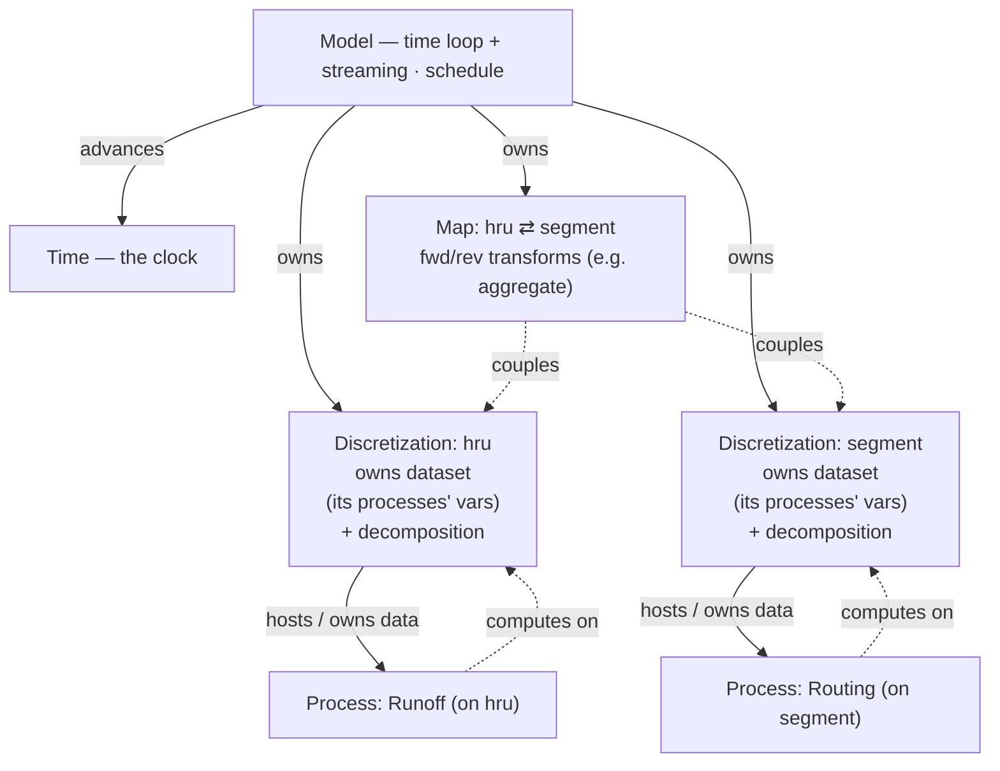

<!-- START doctoc generated TOC please keep comment here to allow auto update -->
<!-- DON'T EDIT THIS SECTION, INSTEAD RE-RUN doctoc TO UPDATE -->

- [Some general ground rules](#some-general-ground-rules)
- [Project context](#project-context)
- [python assumptions/conventions](#python-assumptionsconventions)

<!-- END doctoc generated TOC please keep comment here to allow auto update -->

Hi Claude,

# Some general ground rules

0. Never look at files in directories above the directory containin this file
   (this is the "project" directory).
1. Never run git. Never run any git commands that edit history or remove
   uncommitted files. If you want to run "git diff", please ask first.
2. Do not run any code without my explicit permission. I generally like to run
   codes and copy and paste the result to you. There can be exceptions but you
   must ask permission.
3. Before you make very many edits, I like to have a plan that you and I have
   worked out. I like to discuss the plan with you and to be certain of the
   plan before having you make many edits. Please check in with me if anything
   is not clear, you cant find something, or your're unsure what I'm talking
   about. It is always best for you to check in with me!
4. Number 3 above applies at any point in our work. If there is an issue and
   I suggest something, I want you to discuss with me and not rush off trying
   to fix it (unless it's less than about 10 lines of code).
5. I want you to default to SHORT summaries. I'd like a
   concise summary from you directly and it would be nice to ask if i'd like
   additional detail with the summary. Please do not cretae summary files
   without explicit permission.
6. I want you to ask for permission before spawning additional and/or parallel
   agents. I want to be sure the overhead is justified before hand.

I'm looking forward to working with you, this will be fun. Please give a quick
acknowledgement of these ground rules before we start. Thank you!

# Project context

`pws_phoenix` is a rewrite of pywatershed, a physically-based hydrological model.

The goals of the rewrite are to:

1. integrate closely with the xarray dataset model
2. improve performance as much as possible. to that end
   a. integrate with the mpixarray package
   b. leverage numba to the fullest extent possible
   c. optimize IO, particularly output
   d. explore vectorization
   e. focus on accelerating the embarassingly parallel nature of (non-cascading)
   HRUS to start.
3. Use numpy refs underlying xarray to the fullest extent to keep the memory
   footprint low
4. Provide a reasonable pathway to port existing pywatershed concrete Process
   implementations into pws_phoenix.

More design design considerations are writen down in the top-level README.md,
please read that.

Explicitly solved hydrologic models like `pws_phoenix` advances one timestep at a time (Markov dependency via `var_previous`). The spatial dimension is typically an unstructured vector (HRUs), occasionally 2D (x,y). Time × space is therefore the natural chunking shape for scaling studies.

If additional context arises about this project which is useful to add, please let me know

# python assumptions/conventions

1. please use pyton 3.14 syntax, particularly for typehinting.
2. Please read the ruff.toml for line length setting.
3. Avoid single-letter variable names. For throwaway loop variables, prefer doubled letters, e.g. `cc` instead of `c`, `kk` instead of `k`.

# incarnations/mpixarray design notes

`incarnations/mpixarray/` blends the serial xr Process framework (developed in
`incarnations/xr/`, since retired -- see git history; its design summary is
distilled in "Prior art" below) with mpixarray's streaming MPI IO. The code is
split into
`data_io.py` (IO primitives), `process.py` (the Process framework + `PWS`
accessor), `model.py` (`Model` serial + `ModelMPI` streaming), and
`processes_concrete.py` (the toy Upper/Lower processes); the import stack is
`data_io ← process ← model` and `process ← processes_concrete`. Phase 1 is
implemented and tested (serial via pytest; MPI via pytest-mpi).

## Core decision: discretization = the unit of decomposition

The unit of MPI decomposition (and of barriers / the shared dataset) is the
**discretization** (the grid). "One shared decomposed dataset" really means
"one dataset per discretization." The toy model has exactly one (`space`);
multiple discretizations are Phase 2.

## Variable taxonomy: parameters vs inputs (by relationship to model time)

A field's `kind` (`DataArrayMeta.kind`) and its time axis decide how the
framework treats it. The discriminator is the variable's time coordinate vs
**model time** (daily, fixed, known at init):

- **Static parameter** (`kind="parameter"`, no time axis) -- a fixed property /
  calibration. Loaded once, resident, read-only. (`param_up_0`, `param_common`)
- **Time-varying parameter** (`kind="parameter"`, a time axis whose coordinates
  are **not** model time) -- varies in time but is indexed by a _derived_
  coordinate. Common forms:
  - _cyclic_ -- repeats on a calendar cycle (`month` 1-12, `season`); indexed by
    `f(model_time)`, e.g. `param_up_1[time.month - 1]`.
  - _coarse linear_ -- monotonic but coarser than model time (per-year,
    per-(year,month)); indexed by flooring model time.
    Resident (its own small axis kept whole; space-decomposed in MPI), read-only;
    the current slice is looked up each step. The toy's `param_up_1` is
    cyclic-monthly `(month, space)`, indexed in `Upper.calculate` via `time.month`.
- **Input / time-varying input** (`kind="input"` / `"mutable_input"`, time axis
  **==** model time) -- external forcing/boundary data, one model-time slice
  served per step in lockstep. (`forcing_0`, `forcing_common`)

**Rule (enforced in `ModelMPI._build`):** a `parameter` declared on the model
`time` axis is a misdeclaration -- a variable on model time is an _input_, so a
time-varying parameter must use a non-`time` axis. This also corrects the old
"time-varying params are neither static nor streaming" framing: a cyclic param
is **resident + indexed**, distinct from a _streamed_ input.

To the _Process_, the current slice looks like an input -- a `(space,)` array.
The process holds `time` and does the lookup; `_calculate` receives raw numpy
(the `(space,)` slice), never the `Time` object (numba boundary).

## Serial path (`Model` in `model.py`)

- `Process.new()` builds a per-process `xr.Dataset`: parameters loaded in place
  on the shared parent, inputs wired by reference. Cross-process buffer sharing
  (`param_common`, `forcing_common`, `Upper.flow → Lower.flow`) is preserved by
  reference and checked with `a.values is b.values`.
- The `PWS` accessor dispatches `advance()`/`calculate()` via
  `ds.attrs["process_name"]` → `Process._registry`.
- Output: `data_io.Output` — a buffered, time-chunked **zarr** writer (adapted
  from pywatershed `base/output.py`): one store at `output_dir/output.zarr`,
  all output vars as data_vars, lazy-init sized to `n_times`, full-chunk region
  writes + a partial tail at `finalize`. (netCDF4 was dropped.)

## MPI path (`ModelMPI` in `model.py`) — single-decomposition streaming

Uses the real mpixarray streaming API:
`open_dataset → parallelize(dims=["space"]) → set_streaming("time") →
open_writer → declare buffers → create → iter_time → write`.

- ONE decomposed dataset (`ds_mpi`) carries every process's state, parameters,
  per-step input buffers, and streaming outputs. Because there is one dataset,
  cross-process buffer sharing is **structural** (the same named variable) --
  not emulated by hand and asserted.
- Processes bind directly (`cls(ds_mpi)`) and are rebound to each `step` in the
  loop. There is **no** `Process.new()` MPI path (the old `comm` /
  `local_space_idx` branch was deleted); serial `new()` is unchanged.
- Inputs: time-dimensioned file vars are dropped by `set_streaming` and refilled
  each step from `step.mpi.src`; static space-only params/ICs survive on
  `ds_mpi` (loaded into memory so their buffers are shared by reference).
- `parallelize()` now lives in **`Discretization`** (`discretization.py`):
  `disc.decompose(ds)` does the space split (MPI) or identity (serial,
  `comm=None`). `set_streaming` (time) stays in `ModelMPI`. The datasets:
  `ds_mpi` (decomposed) -> `ds_mpi_stream` (streaming). Model/ModelMPI hold
  `self.discretizations` (a `dict[str, Discretization]` keyed by grid name; one
  entry `"space"` for now) -- so a 2nd grid is just another key. More grids +
  dataset-ownership next.

## Known mpixarray limits (Phase 1)

- Only ONE `to_netcdf=True` streaming-output var works; a 2nd trips a
  "cannot pickle 'module' object" deepcopy (the writer handle is stamped onto
  shared coord attrs, and the next `from_numpy` deepcopies them). So we stream
  `flow` to disk and validate `storage_previous` from final in-memory state.
- `set_streaming` requires the streaming dim to be a real dim-coordinate.
- A non-`time` extra dim on a resident var (e.g. a `(month, space)` cyclic
  time-varying parameter) is assumed to survive `set_streaming` untouched (it is
  not the streaming dim) and stay space-decomposed -- the toy exercises this.

## IO is intentionally NOT apples-to-apples

Serial → zarr; MPI → mpixarray's NetCDF stream. The best IO backend differs by
context, so the two ends are deliberately divergent -- do **not** homogenize
them via a shared writer. (Only matters when isolating compute-vs-IO time in a
scaling study.)

## Global state: `Time` + `Options` (the "Global" split)

The "Global" item is split into two objects with different lifetimes and reach
(rather than one bundled pywatershed-style `Control`):

- **`Time`** (`globals.py`, implemented) -- the model clock: runtime state,
  passed **all the way down** to a process's `calculate(dt, time)` and
  transparent for debugging. Daily, fixed, known at init. Exposes `.current` (a
  `datetime64`), `.month`, `.year`; `set_index(i)` points it at a timestep.
  - _Serial:_ the Model drives the loop and calls `time.set_index(tt)`.
  - _MPI:_ mpixarray owns the time _loop_, so `Time` is **synced from** each
    streaming `step` (`enumerate(iter_time())`). A Process reads it identically
    either way -- this keeps the serial/MPI fork from deepening.
- **`Options`** (not yet a class) -- construction-time run config, consumed at
  _build_ and baked into processes; a Process never needs it at runtime. The
  Model `control` dict plays this role today.

Mechanism notes:

- `Time` is **passed as an argument** to `calculate`, not stashed on the dataset
  (the serial `pws` accessor is built lazily, so passing is cleaner and uniform
  with MPI). `advance()` stays **time-free** -- pure `*_previous` bookkeeping.
- numba boundary: the `Time` object reaches `calculate()`; into a
  `@staticmethod _calculate` pass raw scalars (e.g. a month index), since numba
  can't take the object.
- `time.month` is what a time-varying parameter indexes on (`Upper.calculate`).

**Calendar helpers (ported from pywatershed `utils/time_utils.py`).**
`Time` exposes `year`, `month`, `day_of_month`, `doy` (day-of-year), and `dowy`
(day-of-water-year, Oct 1) -- all matching pywatershed's formulas. All fields
are **1-based** (calendar-natural, = pywatershed's `zero_based=False` default);
positional time-varying-parameter lookup therefore indexes with `field - 1`
(convention (A); see `Upper.calculate` and `tests/test_time.py`). Still in
pywatershed if needed: `jsol` (days since solstice, niche) and `epiweek` (needs
the `epiweeks` dep).

## Phase 2 backlog (separable, layered on top)

- `Options` class -- the construction-time half of the old "Global" item
  (`Time` is implemented; see "Global state: `Time` + `Options`" above). The
  Model `control` dict serves as `Options` for now.
- The full `Discretization` class: physical/topology role + multiple
  discretizations (incl. whether `set_streaming` aligns across ≥2 of them).
- `ModelInputs` / `input_spec()` / `resolve_inputs()` / `init_run_phase()` lazy
  lifecycle (`get_inputs()` is already classmethod-level; streaming's `create()`
  is a latent `init_run_phase`).
- Multi-output-var streaming once the mpixarray deepcopy bug is fixed.
  (Cyclic-monthly time-varying parameters are implemented -- see "Variable
  taxonomy".) Coarse-linear (e.g. per-(year,month)) time-varying params remain.

## Next design topic: container-model unification

The **Process-facing** interface is already uniform: a `Process` only touches
`self._obj[name].values` and is agnostic to whether `_obj` is a standalone
serial dataset or a view into the shared `ds_mpi`. The **container** layer is
what diverges:

- **Serial:** N per-process in-memory `xr.Dataset`s wired by shared buffers --
  sharing is _manual_, hence the `a.values is b.values` asserts (which can break).
- **MPI:** ONE decomposed `ds_mpi`; processes are views -- sharing is
  _structural_, so the same `is` checks are nearly tautological.

The `finalize` asymmetry is a symptom: serial `finalize()` only closes I/O
handles (its in-memory process datasets survive -- _wanted_, for
interactive/post-run inspection), while MPI `finalize()` closes `ds_mpi`. The
consistent contract is "`finalize` **releases external resources**," NOT
"deletes data" -- do not make serial delete its data (no upside; it kills the
inspection serial exists for).

**Candidate direction:** collapse both into ONE shared dataset _per
discretization_, with serial as the _degenerate_ case (one rank, full extent,
plain-xr backend instead of mpixarray). That makes the two genuinely comparable,
makes buffer-sharing _structural in both_ (deleting the fragile serial wiring
_and_ its `is` asserts), and makes "MPI optional" true with no structural fork
-- serial = "MPI with one rank, no MPI."

**Key tension -- namespacing:** N datasets give each process a private namespace
for free; one shared dataset flattens it. Fine where vars _should_ be identical
(`param_common`, `Upper.flow → Lower.flow`), but two processes then can't each
have a private `flow`. Per-discretization grouping narrows it (same-grid
processes share; different grids are separate datasets), but within a grid you
still need a naming discipline or sub-grouping.

Moot for _users_ (`ds_mpi` is never inspected interactively); this is a
_developer_-facing concern -- reasoning plus the buffer-sharing correctness
invariant.

## Object model & serial vs MPI

**All five classes and their relationships.** Serial and MPI share **one object
graph** -- the only differences live _inside_ the Discretization and the Model's
run loop; everything a modeler writes (Processes) and the clock (Time) are
identical across the two. The toy is the single-grid _degenerate_ case: one
`Discretization "space"` hosting Upper/Lower, no Map.



- **"hosts"** = the discretization owns the process's _data_ (its vars live in
  the disc's dataset) **and** holds the process object (tree containment). The
  Model keeps the _schedule_ (cross-grid execution order) as a separate ordering.
- **Processes compute directly** on the disc dataset (`self._obj[name].values`)
  -- no per-process variable views. (In MPI the per-step _streaming window_ is a
  transparent time-slice, not a variable subset.) Shared vars (`param_common`,
  `flow` Upper->Lower) are the same variable in the one dataset -> structural
  sharing, no `a.values is b.values`. The per-grid dataset is **flat** (named
  vars in one `Dataset`), not a DataTree -- see the "Data model" decision under
  Forward design.
- **Discretization is a uniform object** -- the same methods for every grid, no
  subclass / registry / `process_name`-style dispatch (unlike Process). Its
  identity is the Model's dict key (`discretizations["space"]`); it carries no
  `name`. (If grid _types_ ever diverge in topology, subclassing could return --
  not now.)

**Invariant (identical in both):** Model role, Time, Process + its interface, the
object-graph shape, disc-owns-data, and structural buffer sharing.

**What differs -- localized to the Discretization + the Model's run loop:**

|                       | serial                      | MPI                                 |
| --------------------- | --------------------------- | ----------------------------------- |
| Discretization `comm` | `None`                      | a real comm                         |
| backend / extent      | plain xr, full extent       | mpixarray, decomposed               |
| `decompose()`         | identity                    | `parallelize`                       |
| a Process's `_obj`    | `disc.dataset` (persistent) | per-step streaming window (rebound) |
| time loop             | `for tt in range(n)`        | `for step in iter_time()`           |
| input feed            | `Input` objects → dataset   | streaming `src` refill              |
| output / `finalize`   | zarr; keeps its data        | mpixarray NetCDF; releases the ds   |

**One wrinkle -- assembly interleaves at MPI build time.** The "Disc = space,
Model = time" split is conceptually clean but mechanically interleaved in MPI:
mpixarray requires `set_streaming` _before_ declaring buffers, so MPI assembly is
`decompose` (disc/space, → `ds_mpi`) → `set_streaming` (Model/time, → `ds_mpi_stream`)
→ declare buffers on the streamed result. Serial assembly is **disc-only** (one
plain dataset, no time-layer). So in MPI the disc and Model collaborate to build
the dataset; in serial the disc builds it alone.

**Status:** the object graph and the MPI path are in place; serial still builds N
per-process datasets (container-unification pending) -- making serial's
Discretization own one shared dataset is the work that realizes this picture.

## Forward design (June 2026 discussion): structure, schedule, open topics

A working model from design discussion -- **not yet implemented**; it frames the
move from the single-discretization toy to multi-grid pws. Expands on the
container-model topic above.

Target structure -- a tree (conceptually a DataTree; see the data-model caveat):
`Model (root) → {discretizations, maps} → {processes, transforms}`.

- **Model (root):** time, config/options ("Global"), and the run schedule.
- **Discretization:** a grid -- coords + topology + grid-shared data (inherited
  by its processes). One discretization can back several processes.
- **Process:** lives on one discretization; private state + params; `advance` /
  `calculate` operate on its view.
- **Map:** couples two discretizations; **bidirectional**, holding a fwd and a
  rev transform (e.g. disaggregate `dis0→dis1`, aggregate `dis1→dis0`), usually
  parameterized by cross-grid weights. Maps are also where cross-discretization
  MPI partitioning/comm will live (internal, never user-facing).

Containment (where data/code live) -- general multi-grid example:

```
Model (root)                       -- time, config + run schedule
|
+- Discretization: dis0 (hru)      -- coords, topology, grid-shared data
|  +- Process: Runoff
|  +- Process: ...
|
+- Discretization: dis1 (segment, channel network)
|  +- Process: Routing
|
+- Map: dis0 <-> dis1              -- fwd dis0->dis1 (aggregate runoff -> inflow)
                                      rev dis1->dis0 (disaggregate, if needed)
```

(Rendered object-graph diagram: see "Object model & serial vs MPI" above.)

The current toy model is the degenerate single-grid case:

```
Model
+- Discretization: space
   +- Process: Upper
   +- Process: Lower            (Upper.flow -> Lower.flow shared within grid)
```

**Schedule (sub-timestep graph).** Keep two graphs separate: _containment_
(above) vs _execution order_ (what runs).

- **Process order is optional** -- defaults to a known order, subsetted to the
  active processes. **Grid correspondences (maps) are required** (defined once;
  never placed in the order).
- **Maps are implied,** not scheduled -- inserted at each grid boundary in the
  order. The order says _when_ to cross; each process's declared I/O says _what_
  the map carries (the consumer's inputs last produced on another grid).
- **Validation:** error if any process input is not found (forcing / prior
  output / mappable via a registered map).
- **Scope: explicit (one-pass) solutions only.** Iterative cross-grid coupling
  (fixed-point loops) is deliberately out of scope for now (it would need a loop,
  not a flat order).

Execution example -- author writes only the order; the Model inserts the map
steps where consecutive processes change grid:

```
author: [ Snow.dis0, Shading.dis1, SnowMelt.dis0 ]

Model expands to:
   Snow      (dis0)
     | map dis0->dis1   (carries Snow outputs Shading needs)
   Shading   (dis1)
     | map dis1->dis0   (carries Shading outputs SnowMelt needs)
   SnowMelt  (dis0)
```

**Open topics (not yet decided):**

- **Data model (the hard one).** Be skeptical of hierarchy/DataTree as the
  _physical_ layout: the data model's #1 job is zero-copy buffer sharing, which a
  tree does not give (DataTree inherits coords, not data vars; shared vars are
  cross-cutting and fight the tree). DataTree is also serial-only today
  (mpixarray lacks it), so adopting it re-forks serial vs MPI. Reframe: separate
  the _conceptual_ hierarchy (a view/API: namespacing, output groups) from the
  _physical_ layout (a flat pool of shared buffers). The question is "same
  structure or decoupled?", not "DataTree y/n." (See container-model unification.)

  **Decided (June 2026):** keep the **physical layout flat** -- a
  per-discretization `xr.Dataset` (the `discretizations` dict is already the
  multi-grid container), _not_ a DataTree, even if mpixarray gained one.
  "Coords all the way down" is already free inside a flat Dataset; shared data
  vars are cross-cutting (trees inherit coords, not data) so a tree fights the #1
  job; and namespacing -- the tree's main draw -- isn't a concern (flat matches
  pywatershed's flat var/param namespace). Name **collisions are detected at
  assembly** (a cheap check when the Discretization gathers process field specs),
  not prevented structurally. A DataTree could still earn a place later only as a
  _conceptual/output view_ (output groups, multi-grid packaging) over the flat
  pool -- storage sugar, never the runtime/MPI container.

- **Process composition** (a Process _has_ a sub-Process; in the pywatershed dev
  branch): a second, orthogonal hierarchy (process-containment vs
  discretization-containment). Decide encapsulated (outer declares the union I/O;
  inner hidden from the scheduler) vs transparent.
- **FlowGraph** (pywatershed; a `Process` subclass that is itself a graph of
  heterogeneous node units, with `_addtl_output_vars`): REVISIT when the code is
  shared -- stress-tests composition + the data model.
- **Also:** a buffer-ownership rule (one owner, others view -- the zero-copy
  invariant made explicit); restart/checkpoint (serialize full state incl.
  `*_previous`); process-instance multiplicity (can a type appear >1x? keys /
  identity); the single-rate-time assumption (one dt for all).

## Input structuring: serial vs MPI, multi-file / datatree (June 2026)

Design discussion -- **not yet implemented.** Dislike of the "kitchen sink"
all-in-one MPI input file, which gets worse as processes grow. This is the
input-side **mirror of the data-model open topic** above (same logical-vs-
physical split); one naming/namespacing convention should serve all three:
input grouping <-> runtime var names <-> output groups.

**The asymmetry today:**

- **Serial is already structured** -- the `file` path writes one NetCDF _per
  logical input_ (`parameters.nc`, `forcing_0.nc`, ...) and the Model dedups
  shared files. Multi-file input already works.
- **MPI is the kitchen sink** -- `make_toy_input(...).to_netcdf(one_file)`,
  then `open_dataset -> parallelize -> set_streaming`. The single file is
  forced by the _dataset-anchored_ streaming API: `set_streaming`/`iter_time`
  drive **one** time loop over **one** dataset. So the gap is MPI-only.

**DataTree's honest fit:** attractive as _input packaging_ -- an on-disk
hierarchy (`/parameters/upper`, `/forcing`, ...) gives the structure +
namespacing wanted, and DataTree-on-zarr is a real format. But mpixarray
can't parallelize/stream a DataTree (serial-only there; no cross-node buffer
sharing), so **flatten it to flat Dataset(s) before handing it to mpixarray.**
That makes datatree _storage sugar_, not a runtime container -- which dodges
the mpixarray-fork problems.

**The lever -- split static vs streamed inputs:**

- _Static_ (params, ICs; space-only): trivially merged into the one `ds_mpi`
  after `parallelize`, load-once. Multi-file here is ~free and keeps Phase 1's
  structural sharing.
- _Streamed_ (time-varying forcings; time x space): the **only** hard part --
  multiple streamed files = multiple `iter_time` loops to co-step.

**Two strategies (the "merge or manage" framing):**

- **merge** -- combine into one stream; keeps structural buffer sharing, but
  the merge must stay stream-compatible.
- **manage** -- co-iterate N streams; keeps disk structured, but needs API
  support _and_ reintroduces cross-stream buffer sharing.

**Crux question for the mpixarray dev:** can >= 2 parallelized + streamed
datasets be co-iterated (or merged) into one streaming view?

**Near-term, low-risk path:** accept structured / multi-file (or a DataTree)
input, **merge/flatten the static parts into the one `ds_mpi` before
`parallelize`,** and defer multi-_streamed_-forcing to the dev question above.
Keeps Phase 1 intact and makes input-authoring symmetric with serial.

## Prior art: xarray-simlab & Landlab (from the retired xr design summary, Apr 2026)

Distilled from `incarnations/xr/design_summary.md` (retired -- full text in git
history). These comparisons still inform the direction.

**xarray-simlab** (https://xarray-simlab.readthedocs.io)

- _Variable declaration:_ simlab uses class-level, attrs-style declarations with
  `intent` (`xs.variable(dims='x', intent='inout')`, `xs.foreign(Other, 'v',
intent='in')`). Our `DataArrayMeta` fields are the same spirit; `xs.foreign` is
  the explicit, build-time-checked equivalent of our by-name inter-process input
  wiring (we resolve at runtime).
- _Dependency resolution:_ simlab builds an explicit DAG and topologically sorts;
  we use process order -- equivalent for linear chains, less safe for diamonds
  (see the schedule notes above).
- _Data sharing:_ simlab routes foreign vars through a state store each step
  (more copying); ours is zero-copy numpy-reference sharing -- faster but
  dependent on xarray/numpy internals (hence `tests/test_ref_behaviors.py`).
- _Interface:_ simlab is `xr.Dataset` in/out (notebook-friendly); ours is
  explicit config + separate streamed IO (better for long / MPI runs).
- _Net:_ simlab is more polished / compositional / ecosystem-integrated; ours
  makes more deliberate performance/memory choices and is more transparent about
  in-memory layout.

**Landlab** (https://landlab.readthedocs.io)

- _Sharing:_ Landlab components read/write a shared `ModelGrid` field dict
  (implicit sharing by field-name string -- a global namespace); we wire numpy
  buffers explicitly at init (asserted) -- more transparent in the framework,
  less at the script level.
- _Grid-centricity:_ Landlab is deeply 2D-grid-centric; ours is
  dimension-agnostic (space is just an xarray dim -- natural for HRUs /
  sub-basins / 1D reaches; Landlab wins for gridded 2D PDEs).
- _Component interface:_ Landlab's `_input_var_names`/`_output_var_names` +
  `run_one_step(dt)` parallels our `get_inputs()`/`get_variables()`; we split
  `advance()` (state bookkeeping) from `calculate(dt)` (physics) -- cleaner when
  advance is non-trivial (saving `*_previous`).

**Architecture conclusion (Landlab coupling) -- feeds the Maps/Discretization
design.** From the summary's Section 9 (detail in
`external_repos/landlab/landlab_overview.md`):

- A formal **Discretization** (an `xr.Dataset` of HRU areas / connectivity /
  slopes) is worthwhile independent of Landlab and is the **natural unit of MPI
  partitioning** -- the core decision at the top of these notes.
- Keep coupled models on **separate grids**; compute **conservative mapping
  operators offline** as **sparse weight matrices**; use **BMI** as the runtime
  exchange layer (no shared grid object). Same shape as the bidirectional
  **Maps** in the forward-design section (fwd/rev transforms, cross-grid weights).

**Still-open items noted in the summary:** normalize paths (`.resolve()`) before
file dedup; cross-input time-consistency validation (relates to _Input
structuring_ above); finish or remove the from-file `get_mutable_inputs` path.
