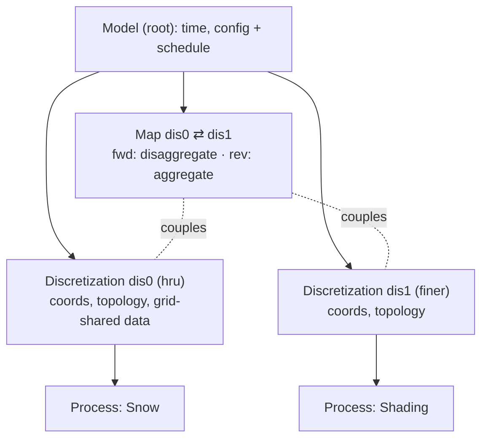

<!-- START doctoc generated TOC please keep comment here to allow auto update -->
<!-- DON'T EDIT THIS SECTION, INSTEAD RE-RUN doctoc TO UPDATE -->

- [Some general ground rules](#some-general-ground-rules)
- [Project context](#project-context)
- [python assumptions/conventions](#python-assumptionsconventions)

<!-- END doctoc generated TOC please keep comment here to allow auto update -->

Hi Claude,

# Some general ground rules

0. Never look at files in directories above the directory containin this file
   (this is the "project" directory).
1. Never run git. Never run any git commands that edit history or remove
   uncommitted files. If you want to run "git diff", please ask first.
2. Do not run any code without my explicit permission. I generally like to run
   codes and copy and paste the result to you. There can be exceptions but you
   must ask permission.
3. Before you make very many edits, I like to have a plan that you and I have
   worked out. I like to discuss the plan with you and to be certain of the
   plan before having you make many edits. Please check in with me if anything
   is not clear, you cant find something, or your're unsure what I'm talking
   about. It is always best for you to check in with me!
4. Number 3 above applies at any point in our work. If there is an issue and
   I suggest something, I want you to discuss with me and not rush off trying
   to fix it (unless it's less than about 10 lines of code).
5. I want you to default to SHORT summaries. I'd like a
   concise summary from you directly and it would be nice to ask if i'd like
   additional detail with the summary. Please do not cretae summary files
   without explicit permission.
6. I want you to ask for permission before spawning additional and/or parallel
   agents. I want to be sure the overhead is justified before hand.

I'm looking forward to working with you, this will be fun. Please give a quick
acknowledgement of these ground rules before we start. Thank you!

# Project context

`pws_phoenix` is a rewrite of pywatershed, a physically-based hydrological model.

The goals of the rewrite are to:

1. integrate closely with the xarray dataset model
2. improve performance as much as possible. to that end
   a. integrate with the mpixarray package
   b. leverage numba to the fullest extent possible
   c. optimize IO, particularly output
   d. explore vectorization
   e. focus on accelerating the embarassingly parallel nature of (non-cascading)
   HRUS to start.
3. Use numpy refs underlying xarray to the fullest extent to keep the memory
   footprint low
4. Provide a reasonable pathway to port existing pywatershed concrete Process
   implementations into pws_phoenix.

More design design considerations are writen down in the top-level README.md,
please read that.

Explicitly solved hydrologic models like `pws_phoenix` advances one timestep at a time (Markov dependency via `var_previous`). The spatial dimension is typically an unstructured vector (HRUs), occasionally 2D (x,y). Time × space is therefore the natural chunking shape for scaling studies.

If additional context arises about this project which is useful to add, please let me know

# python assumptions/conventions

1. please use pyton 3.14 syntax, particularly for typehinting.
2. Please read the ruff.toml for line length setting.
3. Avoid single-letter variable names. For throwaway loop variables, prefer doubled letters, e.g. `cc` instead of `c`, `kk` instead of `k`.

# incarnations/mpixarray design notes

`incarnations/mpixarray/` blends the serial xr Process framework (from
`incarnations/xr/`) with mpixarray's streaming MPI IO. The code is split into
`data_io.py` (IO primitives), `process.py` (the Process framework + `PWS`
accessor), `model.py` (`Model` serial + `ModelMPI` streaming), and
`processes_concrete.py` (the toy Upper/Lower processes); the import stack is
`data_io ← process ← model` and `process ← processes_concrete`. Phase 1 is
implemented and tested (serial via pytest; MPI via pytest-mpi).

## Core decision: discretization = the unit of decomposition

The unit of MPI decomposition (and of barriers / the shared dataset) is the
**discretization** (the grid). "One shared decomposed dataset" really means
"one dataset per discretization." The toy model has exactly one (`space`);
multiple discretizations are Phase 2.

## Serial path (`Model` in `model.py`)

- `Process.new()` builds a per-process `xr.Dataset`: parameters loaded in place
  on the shared parent, inputs wired by reference. Cross-process buffer sharing
  (`param_common`, `forcing_common`, `Upper.flow → Lower.flow`) is preserved by
  reference and checked with `a.values is b.values`.
- The `PWS` accessor dispatches `advance()`/`calculate()` via
  `ds.attrs["process_name"]` → `Process._registry`.
- Output: `data_io.Output` — a buffered, time-chunked **zarr** writer (adapted
  from pywatershed `base/output.py`): one store at `output_dir/output.zarr`,
  all output vars as data_vars, lazy-init sized to `n_times`, full-chunk region
  writes + a partial tail at `finalize`. (netCDF4 was dropped.)

## MPI path (`ModelMPI` in `model.py`) — single-decomposition streaming

Uses the real mpixarray streaming API:
`open_dataset → parallelize(dims=["space"]) → set_streaming("time") →
open_writer → declare buffers → create → iter_time → write`.

- ONE decomposed dataset (`ds_mpi`) carries every process's state, parameters,
  per-step input buffers, and streaming outputs. Because there is one dataset,
  cross-process buffer sharing is **structural** (the same named variable) --
  not emulated by hand and asserted.
- Processes bind directly (`cls(ds_mpi)`) and are rebound to each `step` in the
  loop. There is **no** `Process.new()` MPI path (the old `comm` /
  `local_space_idx` branch was deleted); serial `new()` is unchanged.
- Inputs: time-dimensioned file vars are dropped by `set_streaming` and refilled
  each step from `step.mpi.src`; static space-only params/ICs survive on
  `ds_mpi` (loaded into memory so their buffers are shared by reference).
- The single `parallelize()` call is the **Discretization seam** -- keep it one
  isolated call so promoting it to a real Discretization later is lift-and-shift.

## Known mpixarray limits (Phase 1)

- Only ONE `to_netcdf=True` streaming-output var works; a 2nd trips a
  "cannot pickle 'module' object" deepcopy (the writer handle is stamped onto
  shared coord attrs, and the next `from_numpy` deepcopies them). So we stream
  `flow` to disk and validate `storage_previous` from final in-memory state.
- `set_streaming` requires the streaming dim to be a real dim-coordinate.
- Time-varying parameters (e.g. `param_up_1`, `(time, space)`) are deferred --
  neither static-space nor streaming-input.

## IO is intentionally NOT apples-to-apples

Serial → zarr; MPI → mpixarray's NetCDF stream. The best IO backend differs by
context, so the two ends are deliberately divergent -- do **not** homogenize
them via a shared writer. (Only matters when isolating compute-vs-IO time in a
scaling study.)

## Phase 2 backlog (separable, layered on top)

- A `Global` class (time/config -- note streaming owns the time *loop*).
- The full `Discretization` class: physical/topology role + multiple
  discretizations (incl. whether `set_streaming` aligns across ≥2 of them).
- `ModelInputs` / `input_spec()` / `resolve_inputs()` / `init_run_phase()` lazy
  lifecycle (`get_inputs()` is already classmethod-level; streaming's `create()`
  is a latent `init_run_phase`).
- Time-varying parameters; multi-output-var streaming once the deepcopy bug is
  fixed.

## Next design topic: container-model unification

The **Process-facing** interface is already uniform: a `Process` only touches
`self._obj[name].values` and is agnostic to whether `_obj` is a standalone
serial dataset or a view into the shared `ds_mpi`. The **container** layer is
what diverges:

- **Serial:** N per-process in-memory `xr.Dataset`s wired by shared buffers --
  sharing is *manual*, hence the `a.values is b.values` asserts (which can break).
- **MPI:** ONE decomposed `ds_mpi`; processes are views -- sharing is
  *structural*, so the same `is` checks are nearly tautological.

The `finalize` asymmetry is a symptom: serial `finalize()` only closes I/O
handles (its in-memory process datasets survive -- *wanted*, for
interactive/post-run inspection), while MPI `finalize()` closes `ds_mpi`. The
consistent contract is "`finalize` **releases external resources**," NOT
"deletes data" -- do not make serial delete its data (no upside; it kills the
inspection serial exists for).

**Candidate direction:** collapse both into ONE shared dataset *per
discretization*, with serial as the *degenerate* case (one rank, full extent,
plain-xr backend instead of mpixarray). That makes the two genuinely comparable,
makes buffer-sharing *structural in both* (deleting the fragile serial wiring
*and* its `is` asserts), and makes "MPI optional" true with no structural fork
-- serial = "MPI with one rank, no MPI."

**Key tension -- namespacing:** N datasets give each process a private namespace
for free; one shared dataset flattens it. Fine where vars *should* be identical
(`param_common`, `Upper.flow → Lower.flow`), but two processes then can't each
have a private `flow`. Per-discretization grouping narrows it (same-grid
processes share; different grids are separate datasets), but within a grid you
still need a naming discipline or sub-grouping.

Moot for *users* (`ds_mpi` is never inspected interactively); this is a
*developer*-facing concern -- reasoning plus the buffer-sharing correctness
invariant.

## Forward design (June 2026 discussion): structure, schedule, open topics

A working model from design discussion -- **not yet implemented**; it frames the
move from the single-discretization toy to multi-grid pws. Expands on the
container-model topic above.

Target structure -- a tree (conceptually a DataTree; see the data-model caveat):
`Model (root) → {discretizations, maps} → {processes, transforms}`.

- **Model (root):** time, config/options ("Global"), and the run schedule.
- **Discretization:** a grid -- coords + topology + grid-shared data (inherited
  by its processes). One discretization can back several processes.
- **Process:** lives on one discretization; private state + params; `advance` /
  `calculate` operate on its view.
- **Map:** couples two discretizations; **bidirectional**, holding a fwd and a
  rev transform (e.g. disaggregate `dis0→dis1`, aggregate `dis1→dis0`), usually
  parameterized by cross-grid weights. Maps are also where cross-discretization
  MPI partitioning/comm will live (internal, never user-facing).

Containment (where data/code live) -- general multi-grid example:

```
Model (root)                       -- time, config + run schedule
|
+- Discretization: dis0 (hru)      -- coords, topology, grid-shared data
|  +- Process: Snow
|  +- Process: ...
|
+- Discretization: dis1 (terrain/veg, finer)
|  +- Process: Shading
|
+- Map: dis0 <-> dis1              -- fwd dis0->dis1 (disaggregate)
                                      rev dis1->dis0 (aggregate)
```



The current toy model is the degenerate single-grid case:

```
Model
+- Discretization: space
   +- Process: Upper
   +- Process: Lower            (Upper.flow -> Lower.flow shared within grid)
```

**Schedule (sub-timestep graph).** Keep two graphs separate: *containment*
(above) vs *execution order* (what runs).

- **Process order is optional** -- defaults to a known order, subsetted to the
  active processes. **Grid correspondences (maps) are required** (defined once;
  never placed in the order).
- **Maps are implied,** not scheduled -- inserted at each grid boundary in the
  order. The order says *when* to cross; each process's declared I/O says *what*
  the map carries (the consumer's inputs last produced on another grid).
- **Validation:** error if any process input is not found (forcing / prior
  output / mappable via a registered map).
- **Scope: explicit (one-pass) solutions only.** Iterative cross-grid coupling
  (fixed-point loops) is deliberately out of scope for now (it would need a loop,
  not a flat order).

Execution example -- author writes only the order; the Model inserts the map
steps where consecutive processes change grid:

```
author: [ Snow.dis0, Shading.dis1, SnowMelt.dis0 ]

Model expands to:
   Snow      (dis0)
     | map dis0->dis1   (carries Snow outputs Shading needs)
   Shading   (dis1)
     | map dis1->dis0   (carries Shading outputs SnowMelt needs)
   SnowMelt  (dis0)
```

**Open topics (not yet decided):**

- **Data model (the hard one).** Be skeptical of hierarchy/DataTree as the
  *physical* layout: the data model's #1 job is zero-copy buffer sharing, which a
  tree does not give (DataTree inherits coords, not data vars; shared vars are
  cross-cutting and fight the tree). DataTree is also serial-only today
  (mpixarray lacks it), so adopting it re-forks serial vs MPI. Reframe: separate
  the *conceptual* hierarchy (a view/API: namespacing, output groups) from the
  *physical* layout (a flat pool of shared buffers). The question is "same
  structure or decoupled?", not "DataTree y/n." (See container-model unification.)
- **Process composition** (a Process *has* a sub-Process; in the pywatershed dev
  branch): a second, orthogonal hierarchy (process-containment vs
  discretization-containment). Decide encapsulated (outer declares the union I/O;
  inner hidden from the scheduler) vs transparent.
- **FlowGraph** (pywatershed; a `Process` subclass that is itself a graph of
  heterogeneous node units, with `_addtl_output_vars`): REVISIT when the code is
  shared -- stress-tests composition + the data model.
- **Also:** a buffer-ownership rule (one owner, others view -- the zero-copy
  invariant made explicit); restart/checkpoint (serialize full state incl.
  `*_previous`); process-instance multiplicity (can a type appear >1x? keys /
  identity); the single-rate-time assumption (one dt for all).

## Input structuring: serial vs MPI, multi-file / datatree (June 2026)

Design discussion -- **not yet implemented.** Dislike of the "kitchen sink"
all-in-one MPI input file, which gets worse as processes grow. This is the
input-side **mirror of the data-model open topic** above (same logical-vs-
physical split); one naming/namespacing convention should serve all three:
input grouping <-> runtime var names <-> output groups.

**The asymmetry today:**

- **Serial is already structured** -- the `file` path writes one NetCDF *per
  logical input* (`parameters.nc`, `forcing_0.nc`, ...) and the Model dedups
  shared files. Multi-file input already works.
- **MPI is the kitchen sink** -- `make_toy_input(...).to_netcdf(one_file)`,
  then `open_dataset -> parallelize -> set_streaming`. The single file is
  forced by the *dataset-anchored* streaming API: `set_streaming`/`iter_time`
  drive **one** time loop over **one** dataset. So the gap is MPI-only.

**DataTree's honest fit:** attractive as *input packaging* -- an on-disk
hierarchy (`/parameters/upper`, `/forcing`, ...) gives the structure +
namespacing wanted, and DataTree-on-zarr is a real format. But mpixarray
can't parallelize/stream a DataTree (serial-only there; no cross-node buffer
sharing), so **flatten it to flat Dataset(s) before handing it to mpixarray.**
That makes datatree *storage sugar*, not a runtime container -- which dodges
the mpixarray-fork problems.

**The lever -- split static vs streamed inputs:**

- *Static* (params, ICs; space-only): trivially merged into the one `ds_mpi`
  after `parallelize`, load-once. Multi-file here is ~free and keeps Phase 1's
  structural sharing.
- *Streamed* (time-varying forcings; time x space): the **only** hard part --
  multiple streamed files = multiple `iter_time` loops to co-step.

**Two strategies (the "merge or manage" framing):**

- **merge** -- combine into one stream; keeps structural buffer sharing, but
  the merge must stay stream-compatible.
- **manage** -- co-iterate N streams; keeps disk structured, but needs API
  support *and* reintroduces cross-stream buffer sharing.

**Crux question for the mpixarray dev:** can >= 2 parallelized + streamed
datasets be co-iterated (or merged) into one streaming view?

**Near-term, low-risk path:** accept structured / multi-file (or a DataTree)
input, **merge/flatten the static parts into the one `ds_mpi` before
`parallelize`,** and defer multi-*streamed*-forcing to the dev question above.
Keeps Phase 1 intact and makes input-authoring symmetric with serial.
